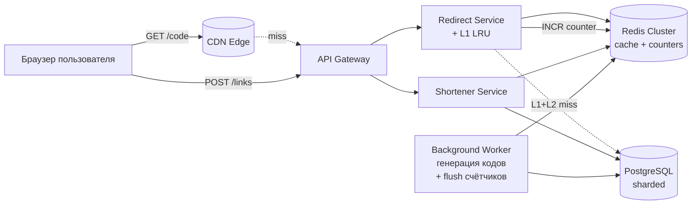
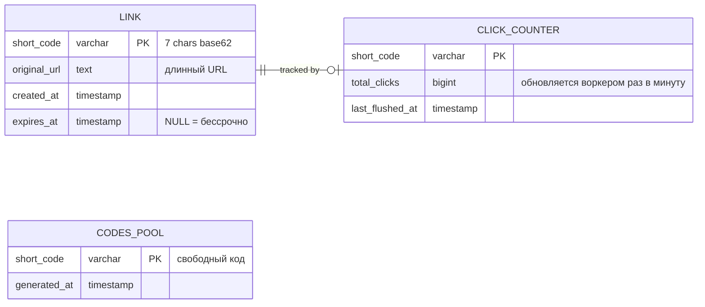
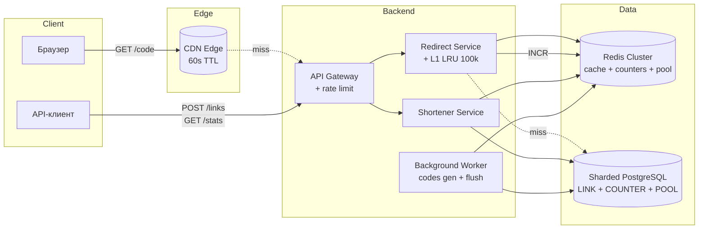
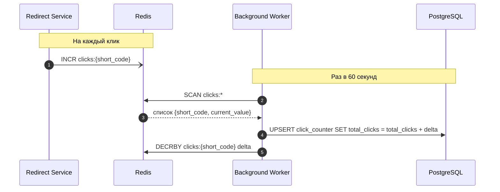
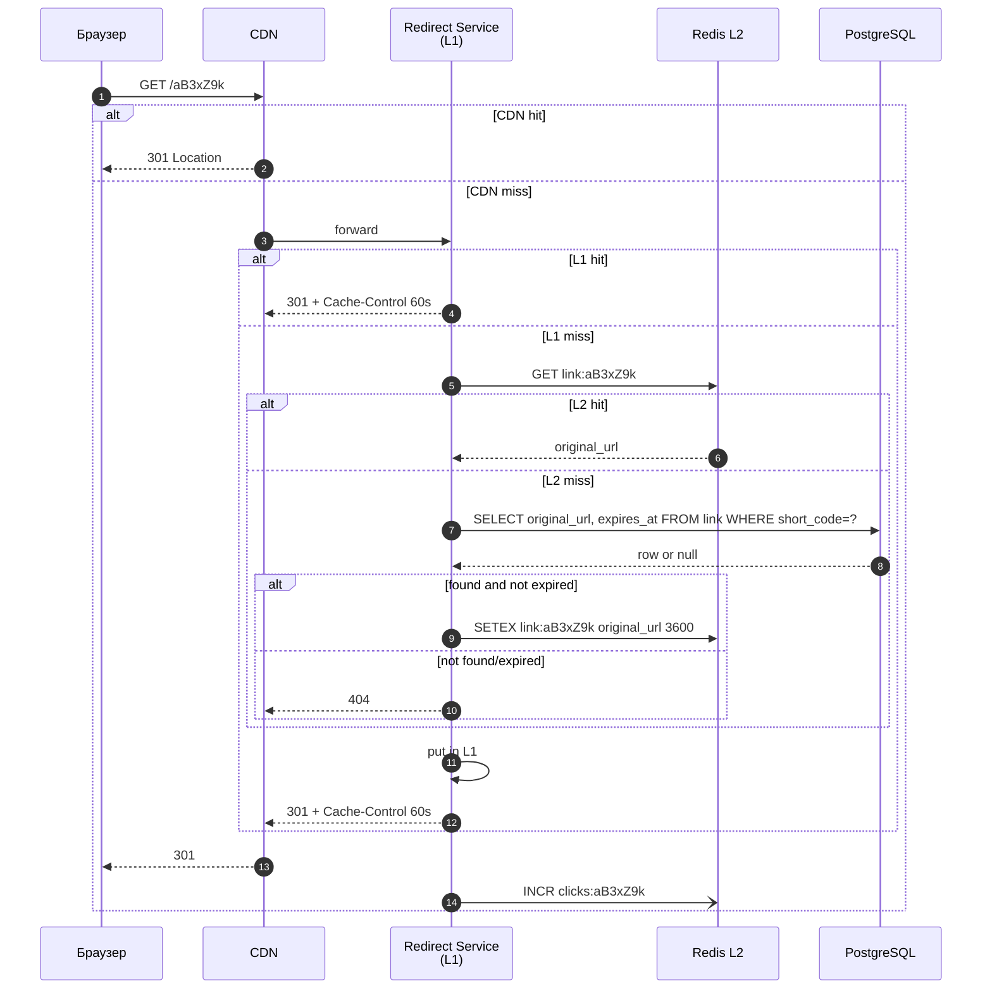
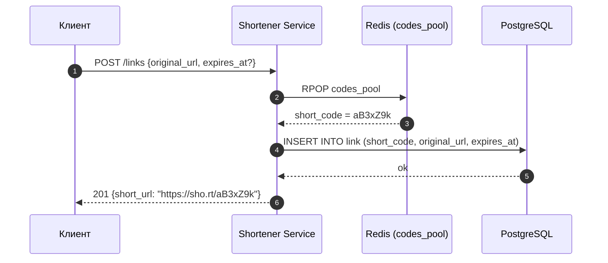
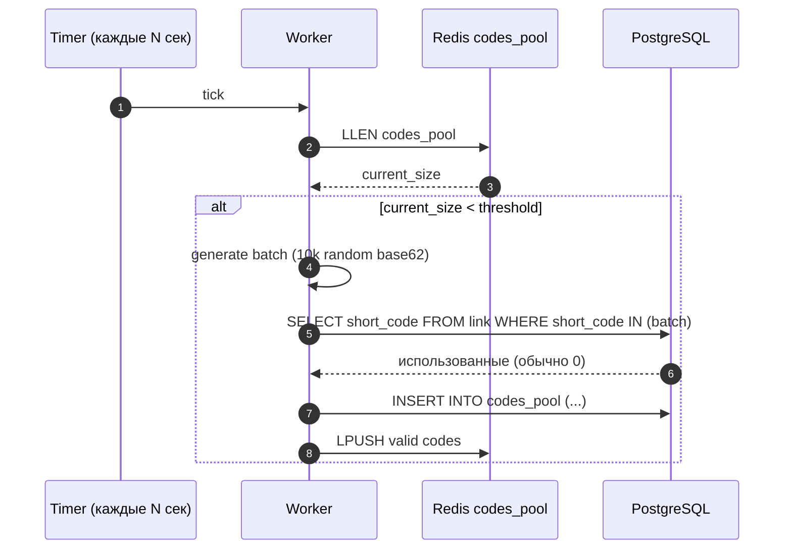
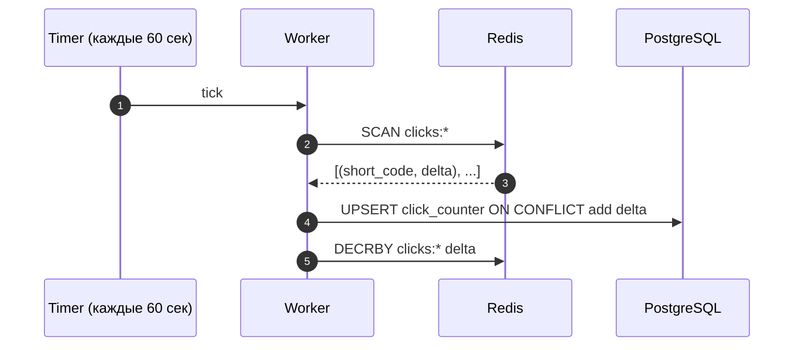
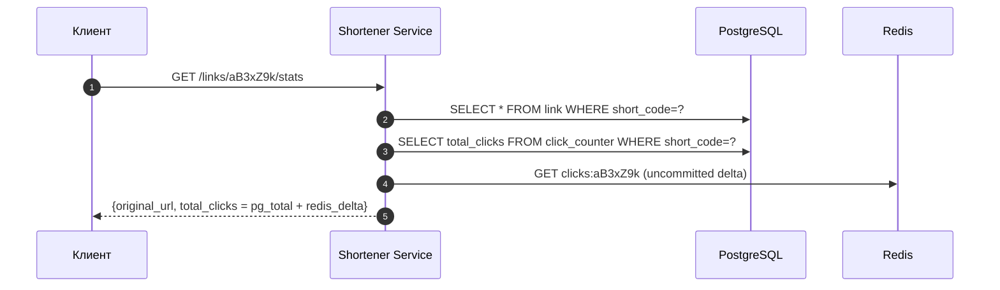

# Техническое решение проекта «URL Shortener»

## 1. Введение

### 1.1. Что это и кому нужно

«URL Shortener» — сервис, превращающий длинный URL в короткую ссылку и выполняющий редирект по этой короткой ссылке. Классические примеры из реального мира — Bitly, TinyURL, `t.co` Twitter/X, `t.me/joinchat/...` Telegram, корпоративные шортенеры маркетинговых отделов.

Типичные сценарии применения:

- **Маркетинговые кампании.** Длинный URL с UTM-метками не помещается в SMS, на наружную рекламу, в QR-код. Маркетолог хочет получить ссылку быстро, а конечный пользователь — мгновенно попасть на сайт.
- **QR-коды на печатных материалах.** Билборды, упаковка, чеки. Сама ссылка живёт годами, ходят по ней миллионами.
- **Шеринг в мессенджерах и соцсетях.** Историческое ограничение Twitter в 140 символов, ограничения SMS, удобство «короткой» ссылки в чате.
- **Внутренние корпоративные ссылки.** Reference на длинные URL внутри Confluence, дашбордов, монорепо.

Общий паттерн нагрузки во всех этих сценариях один и тот же: **создаём редко, ходим часто**. Соотношение чтения к записи — 20:1 и хуже.

### 1.2. На чём фокусируемся

Главный пользовательский опыт — это **момент клика по короткой ссылке**. Пользователь не должен заметить, что между его кликом и открытием целевого сайта вообще что-то происходит. Поэтому решение оптимизируется по одной главной метрике:

> **Минимальная и предсказуемая латентность редиректа при пиковых нагрузках 200k RPS на чтение.**

Ради этой цели мы сознательно делаем компромиссы во всём, что пользователь напрямую не замечает: точность статистики, скорость распространения истечения ссылки, идемпотентность повторных запросов на создание и т. п. Эти компромиссы перечислены явно ниже.

### 1.3. Ограничения по ресурсам разработки

Решение проектируется в реалистичных условиях:

- Команда 3–5 инженеров, MVP за квартал.
- Бюджет инфраструктуры — десятки тысяч долларов в месяц, а не сотни. Никаких ML-сервисов, real-time аналитики, мульти-региональных active-active кластеров.
- Используются стандартные компоненты, которые команда умеет эксплуатировать: PostgreSQL, Redis, NGINX/CDN. Никакой экзотики.
- Никакого ClickHouse, Kafka, Cassandra и т. п. на старте — добавим, если действительно упрёмся в потолок.

Это формирует архитектуру: **минимум движущихся частей, максимум кэширования**.

---

## 2. Система гарантий и ограничений

Перед погружением в детали явно фиксируем, что система гарантирует и от чего отказывается. Дальнейшие решения вытекают из этого контракта.

### 2.1. Система гарантирует

| # | Гарантия | Почему критично |
|---|----------|-----------------|
| G1 | **Корректность редиректа.** Если ссылка существует и не истекла — редирект ведёт ровно на тот URL, который ввёл создатель. | Иначе теряется доверие к сервису. |
| G2 | **Сохранность созданных ссылок.** Подтверждённая создателем ссылка не теряется, пока не истёк её срок. | Маркетинговая кампания не должна «обвалиться». |
| G3 | **Уникальность short_code.** Один код всегда указывает на ровно один URL за всё время жизни. | Иначе перепутаются переходы разных пользователей. |
| G4 | **Низкая латентность редиректа.** P95 ≤ 50 мс на стороне сервиса. | Это и есть пользовательский опыт. |
| G5 | **Доступность редиректа 99.99 %.** | Контур чтения важнее контура записи. |

### 2.2. Система НЕ гарантирует (сознательные отказы)

| # | Отказ | Что это значит на практике | Почему допустимо |
|---|-------|----------------------------|------------------|
| R1 | **Сильную консистентность статистики.** | Счётчик переходов может отставать на минуты от реального числа кликов. | Маркетолог смотрит дашборды раз в день; «±100 кликов» он не заметит. |
| R2 | **Точный учёт каждого клика.** | Допускаем потерю ≤ 0.1 % кликов при сбое узла. | Никакая бизнес-логика не зависит от точного числа кликов. |
| R3 | **Мгновенное истечение ссылки.** | После `expires_at` ещё до ~60 секунд может работать редирект (TTL кэша). | Маркетолог не указывает срок истечения с точностью до секунды. |
| R4 | **Строгую идемпотентность создания.** | При сетевом ретрае на `POST /links` теоретически может создаться второй short_code для того же URL. | Создание ссылок — редкая операция; такая «небольшая утечка» в codes pool не критична. |
| R5 | **Доступность создания 99.99 %.** | SLA контура записи — 99.9 %. | Маркетолог переживёт пару минут даунтайма создания, конечный пользователь — нет. |
| R6 | **Детальную аналитику.** | Только `total_clicks`, без geo/device/referrer. | Это уже следующий продукт. |
| R7 | **Кастомные домены, A/B, branded slugs.** | Только автогенерируемые коды на одном домене `sho.rt`. | Вне MVP. |

Эта таблица — фундамент всех дальнейших решений. Когда возникает вопрос «а что если…», ответ ищем в ней: если случай покрыт R1–R7 — это сознательный компромисс, а не баг.

---

## 3. Глоссарий

| Термин | Определение |
| --- | --- |
| Original URL | Исходный длинный адрес. |
| Short URL | Короткая ссылка вида `https://sho.rt/{short_code}`. |
| Short code | Короткий идентификатор, 7 символов из base62-алфавита (`a–z`, `A–Z`, `0–9`). |
| Redirect | HTTP 301/302 на исходный URL. |
| Hot key | Очень популярный short_code, дающий аномально большую долю трафика. |
| Codes Pool | Предсгенерированный пул свободных short_code, FIFO-очередь. |
| TTL | Time-to-live для записи в кэше. |
| L1 / L2 | Локальный (в памяти процесса) / распределённый (Redis) уровни кэша. |

---

## 4. Функциональные требования

ФТ намеренно минимальные:

1. **Создание короткой ссылки.** `POST /links` принимает `original_url` и опциональный `expires_at`, возвращает `short_url`.
2. **Редирект.** `GET /{short_code}` отдаёт HTTP 301 на исходный URL. Если ссылки нет или она истекла — 404.
3. **Статистика.** `GET /links/{short_code}/stats` возвращает `total_clicks`. Eventual consistency допустима.

Всё остальное (юзеры, авторизация, кастомные slugs, аналитика) сознательно вне MVP.

---

## 5. Нефункциональные требования

| Метрика | Значение |
|---|---|
| RPS на запись | 10 000 пик |
| RPS на редирект | 200 000 пик |
| Read/Write | ≈ 20:1 |
| P95 редирект | ≤ 50 мс |
| P95 создание | ≤ 100 мс |
| P95 статистика | ≤ 200 мс |
| SLA редирект | 99.99 % |
| SLA запись и статистика | 99.9 % |

---

## 6. Основные компоненты и их функции

Архитектура спроектирована так, чтобы её можно было поместить в одну схему и объяснить за 60 секунд. Всего 6 компонентов плюс CDN.

| # | Компонент | Что делает | Что НЕ делает |
|---|-----------|-----------|----------------|
| 1 | **CDN** | Кэширует сам HTTP-ответ `301 Location: …` на edge-узлах на 60 секунд. Первая линия обороны от hot keys. | Не знает о бизнес-логике, не работает с БД. |
| 2 | **API Gateway** | TLS-терминация, rate limiting на запись (защита от ботов), маршрутизация. | Не делает кэш — кэш лежит в CDN и в сервисах. |
| 3 | **Redirect Service** | Только обслуживает `GET /{short_code}`. Имеет локальный L1 LRU-кэш на ~100k самых горячих ключей. При промахе ходит в Redis (L2), при промахе и там — в PostgreSQL. Делает `INCR` счётчика в Redis fire-and-forget. | Не пишет в PostgreSQL. Не агрегирует статистику. |
| 4 | **Shortener Service** | Обслуживает `POST /links` и `GET /links/{code}/stats`. Берёт код из пула, пишет в PostgreSQL. Для статистики читает счётчик из Redis + метаданные из PG. | Не обслуживает редиректы. |
| 5 | **Redis Cluster** | Три роли в одном кластере: (а) L2-кэш маппинга `short_code → original_url` с TTL=1ч, (б) счётчики кликов через атомарный `INCR`, (в) хвостовая очередь свободных кодов из пула. | Не источник правды. |
| 6 | **PostgreSQL (sharded)** | Источник правды: маппинг ссылок и сам codes pool. Шардируется по `hash(short_code)`. | Не обслуживает hot-path редиректа напрямую — только при cache miss. |
| 7 | **Background Worker** | Делает две скучные офлайн-задачи: (1) пополняет codes pool, генерируя новые коды; (2) раз в минуту сливает счётчики из Redis в PostgreSQL, чтобы не терять их насовсем. | Не участвует в обработке клиентских запросов. |

**Что важно понимать про эту картинку:**

- **Чтения и записи разделены физически:** Redirect Service и Shortener Service — это разные процессы, разные пулы машин, разные SLA. Уронить контур записи можно, контур чтения уронить нельзя.
- **Между сервисами нет очередей и брокеров.** Никакой Kafka на старте. Если нужно «дотечь» данные из Redis в Postgres, это делает Background Worker по таймеру. Если данные потеряются — это R2, мы это допускаем.
- **Postgres стоит за тремя слоями кэша** (CDN, L1, L2). К нему доходят буквально проценты исходных 200k RPS — основная работа Postgres это запись новых ссылок, а не редиректы.

### 6.1. Уровень детализации каждого компонента

Чтобы было понятно, где мы остановились в проработке и от чего отказались:

| Компонент | Что проработано | От чего отказались (и почему) |
|---|---|---|
| CDN | Стандартный (Cloudflare/Fastly), cache на 60 сек на ответе редиректа | Свой edge-кластер — слишком дорого для MVP |
| API Gateway | Простой NGINX или managed (AWS API GW) с rate limit | Свой gateway — не нужно |
| Redirect Service | Stateless Go-сервис, L1 — обычная in-process LRU библиотека (например, `freecache`/`bigcache`) | Кастомный shared memory — оверкилл |
| Shortener Service | Тот же стек, обычный CRUD | Свой алгоритм генерации кодов — заменён на пул (см. ниже) |
| Redis | Один шардированный кластер на 3–6 узлов | Отдельные Redis под кэш и под счётчики — лишняя сложность |
| PostgreSQL | 4–8 шардов с одной репликой каждый, по `hash(short_code)` | Кросс-шардовые транзакции, 2PC, distributed SQL (CockroachDB/Yugabyte) — нам не нужны: у нас один ключ доступа `short_code`, поэтому нет cross-shard операций в принципе |
| Background Worker | Простой cron-подобный воркер | Сложный поток обработки событий, ClickHouse — отложим до v2 |

---

## 7. Пользовательские сценарии

### 7.1. Переход по короткой ссылке (главный сценарий)

1. Пользователь кликает на `https://sho.rt/aB3xZ9k`.
2. Браузер делает GET на ближайший edge CDN.
3. CDN в 60–80 % случаев отдаёт закэшированный `301 Location: …` без обращения к нашему бэкенду.
4. Иначе запрос доезжает до Redirect Service, который смотрит сначала в L1 (in-memory), потом в L2 (Redis), потом в PostgreSQL.
5. Пользователь получает 301 и попадает на исходный сайт.
6. Параллельно (fire-and-forget) увеличивается счётчик в Redis.

### 7.2. Создание короткой ссылки

1. Клиент шлёт `POST /links {original_url, expires_at?}`.
2. Shortener Service берёт следующий код из пула в Redis (`RPOP`).
3. Вставляет запись в PostgreSQL.
4. Возвращает `short_url`.

### 7.3. Просмотр статистики

1. Клиент шлёт `GET /links/aB3xZ9k/stats`.
2. Shortener Service читает `total_clicks` из Redis-счётчика и метаданные из PostgreSQL.
3. Возвращает результат. Допустим лаг с реальностью до минуты (R1).

---

## 8. Модель данных

Модель данных сознательно простая: только **денормализованные таблицы**, никаких join-ов на горячем пути.

### 8.1. Что и где живёт

| Сущность | Где хранится | Зачем именно там |
|---|---|---|
| `LINK` (источник правды) | PostgreSQL, шардирование по `hash(short_code)` | Долгоживущие данные, нужны транзакции на создание, нужны индексы. |
| `LINK` (горячая копия) | Redis L2: ключ `link:{short_code}` → `original_url`, TTL=1ч | Мгновенный read. |
| `CODES_POOL` (мастер) | PostgreSQL, отдельная таблица | Источник правды о свободных кодах. |
| `CODES_POOL` (рабочая очередь) | Redis LIST: `codes_pool` | Атомарный `RPOP` за O(1). |
| `CLICK_COUNTER` (live) | Redis: ключ `clicks:{short_code}` через `INCR` | Атомарный инкремент за < 1 мс, выдерживает любые RPS. |
| `CLICK_COUNTER` (durable) | PostgreSQL, таблица `click_counter` | Чтобы не потерять навсегда при перезагрузке Redis. |

### 8.2. Почему такая денормализация — это правильно

- **Нет join-ов на hot path.** Редирект — это лукап по primary key. Точка.
- **Маппинг иммутабельный.** После создания `LINK` его `original_url` не меняется. Это значит, что инвалидация кэша почти не нужна (только TTL по истечении ссылки).
- **Счётчик в Redis отделён от строки `LINK`.** Если бы счётчик жил прямо в `LINK`, каждый клик обновлял бы строку — это упёрло бы PostgreSQL в потолок по RPS на запись.

### 8.3. Генерация short_code и пул

Алгоритм:

1. Background Worker генерирует случайные строки длиной 7 символов в base62 (62⁷ ≈ 3.5 × 10¹² комбинаций).
2. Проверяет, не использованы ли они (LEFT ANTI JOIN с `LINK` на батче).
3. Кладёт валидные в таблицу `CODES_POOL` в Postgres и одновременно `LPUSH`-ит в Redis-список.
4. Shortener Service в момент `POST /links` делает `RPOP` из Redis — получает гарантированно свободный код за O(1), без коллизий.

Что мы получаем:

- **Никаких retry на коллизию в hot path записи.** Коллизионная проверка идёт офлайн.
- **Детерминированная латентность создания.**
- При неуспехе вставки в `LINK` (например, дубль `idempotency_key`, если мы потом такое добавим) — код можно вернуть в пул через `LPUSH`. Если код «утечёт» — это утечка из 3.5 трлн комбинаций, мы это переживём (R4).

### 8.4. Шардирование

Шардируем только `LINK` по `hash(short_code)`. Это даёт три полезных свойства:

- **Тривиальный роутинг:** клиент Postgres знает шард прямо из ключа запроса.
- **Никаких cross-shard операций:** все запросы — это поинт-лукап по PK либо инсерт по PK.
- **Простое горизонтальное расширение:** добавили шард — переехала часть ключей через consistent hashing.

`CODES_POOL` и `CLICK_COUNTER` не шардируем — они маленькие и не требуют масштабирования отдельно.

---

## 9. Архитектура

Архитектура с учётом всего вышесказанного:

### 9.1. Многоуровневый кэш — главный «секретный соус»

Поскольку маппинг иммутабелен (см. §8.2), мы можем кэшировать максимально агрессивно:

| Уровень | Где | Время доступа | Hit rate | Эффект |
|---|---|---|---|---|
| L0 | CDN edge | 1–5 мс RTT | 60–80 % | Топ-ссылки никогда не доходят до бэкенда |
| L1 | In-memory LRU (100k записей) | < 1 мс | 85–95 % от L0 miss | Защита Redis от hot key |
| L2 | Redis Cluster, TTL 1ч | 1–2 мс | 95 %+ от L1 miss | Шаринг кэша между инстансами |
| L3 | PostgreSQL | 5–20 мс | очень редко | Source of truth |

200 000 RPS на входе превращаются примерно в 200–2000 RPS на PostgreSQL — задача под силу одному скромному кластеру.

### 9.2. Счётчики кликов: Redis INCR + периодический flush

Почему это работает и почему этого достаточно:

- **`INCR` в Redis** — атомарная операция, латентность < 1 мс, не требует блокировок. Выдерживает 200k RPS легко.
- **Flush раз в минуту** — это батч на тысячи короткодеев одним апдейтом в Postgres. Снимает с Postgres нагрузку write-heavy.
- **Что если Redis упал** — потеряем не сохранённую часть счётчика (буквально кликов за последние 60 секунд по каждой ссылке). По R2 это допустимо.

### 9.3. Hot keys

Без специальной защиты одна «вирусная» ссылка может посадить один шард Redis. Защита трёхступенчатая:

1. **CDN кэширует ответ редиректа на 60 секунд.** Для вирусной ссылки это значит, что 99 % её трафика обслуживается на edge.
2. **L1 LRU в каждом инстансе Redirect Service** размером 100k записей. Топ-ключи прибиваются в локальной памяти.
3. **Реплики Redis на чтение** на случай, если всё-таки упрёмся.

В сумме: вирусная ссылка не «убивает» один Redis-шард, потому что до Redis-шарда её трафик почти не доходит.

---

## 10. Технические сценарии

### 10.1. Редирект (главный hot path, 200k RPS)

Свойства:

- При hot key реальный бэкенд **не трогается совсем**.
- При L1 hit ответ собирается за ≈ 1 мс.
- `INCR` идёт **после** отправки ответа пользователю и **не блокирует** редирект.

### 10.2. Создание ссылки

Без блокировок, без retry, без race conditions — потому что код «зарезервирован» в пуле раньше, чем пришёл запрос.

### 10.3. Пополнение пула (Background Worker)

### 10.4. Сброс счётчиков (Background Worker)

### 10.5. Просмотр статистики

Возвращаем сумму закоммиченного счётчика и текущего «незалитого» дельты в Redis — получаем почти-реалтайм без рисков потери.

---

## 11. Обоснование решений и компромиссы

### 11.1. Что в системе точно нужно (без чего никак)

| Компонент | Без чего ломается |
|---|---|
| CDN edge cache | При hot key загибается весь бэкенд. Это самый дешёвый и самый эффективный слой. |
| L1 in-memory кэш | Без него Redis становится узким местом по RPS и сети. |
| Redis L2 | Без него каждый L1 miss бьёт в Postgres. |
| Шардирование Postgres | Без него один Postgres не выдержит запись 10k RPS и поток cache-miss-ов. |
| Codes pool | Без него запись имеет ретраи на коллизию → недетерминированная латентность. |
| Background Worker для счётчиков | Без него либо теряются клики, либо Postgres ложится под 200k RPS write. |

### 11.2. От чего сознательно отказались и почему

| Отказались от | Что выиграли | Что потеряли | Компенсация |
|---|---|---|---|
| **Kafka между сервисами** | Меньше компонентов в эксплуатации, проще дебажить | Нет «магистрали» для будущих фич аналитики | Добавим, когда понадобится — нынешняя архитектура не блокирует этот апгрейд |
| **ClickHouse для CLICK_EVENT** | Не нужно поддерживать второе хранилище | Нет детальной поклик-аналитики | Соответствует R6 — её и не требовалось |
| **Stats Aggregator как отдельный сервис** | Меньше деплоев | Логика flush-а живёт в Background Worker | Они почти одинаковы по реализации |
| **Идемпотентность создания** | Не нужно тащить unique-индекс по idempotency_key и логику дедупликации | Сетевой ретрай может создать «дубль»-ссылку | R4: утечка из 3.5 трлн кодов — допустима |
| **Сильная консистентность счётчика** | Можно использовать Redis INCR и батч-flush | Лаг 1 мин в статистике | R1 — лаг допустим |
| **Мульти-регион active-active** | В разы меньше операционной сложности | При фейле региона сервис недоступен в этом регионе | На MVP single-region достаточно для 99.99 % на чтение (CDN всё равно глобален) |

### 11.3. Где платим за выбранную стратегию

- **Память L1.** 100k записей × 200 байт × 12 инстансов ≈ 240 МБ суммарно — копейки.
- **Дублирование данных** (LINK живёт в Postgres и в Redis, COUNTER живёт там же). Это сознательная цена за денормализацию и скорость.
- **Возможная потеря ~0.1 % кликов при сбое Redis.** В нашем UX это незаметно.
- **Лаг счётчика до 1 минуты.** Тоже незаметно для маркетингового сценария.

### 11.4. Что мы получили в итоге

- Архитектура из **6 компонентов** + CDN. Любой инженер из команды разберётся за день.
- Главная метрика (P95 редирект ≤ 50 мс при 200k RPS) достигается за счёт каскада кэшей.
- Главный пользовательский опыт (мгновенный клик → открытие сайта) защищён трёхступенчато: CDN, L1, L2.
- Создание ссылок детерминированно по латентности.
- Статистика «достаточно точная» при минимальной нагрузке на БД.
- Все сознательные компромиссы (R1–R7) — управляемые и описанные.

---

## 12. Что дальше (вне MVP)

Если когда-нибудь понадобится больше, архитектура расширяется без переписывания:

- **Детальная аналитика** → добавляется Kafka между Redirect Service и аналитическим хранилищем (ClickHouse), сам Redirect Service не меняется.
- **Кастомные домены и branded slugs** → меняется только Shortener Service.
- **Multi-region** → CDN уже глобален; Redis и Postgres получают read-replica в нужных регионах.
- **Anti-abuse / phishing detection** → отдельный async-сервис проверяет URL при создании.

Архитектура спроектирована так, чтобы её **расширение не требовало переделки hot path** редиректа — а именно этот hot path и есть продукт.
