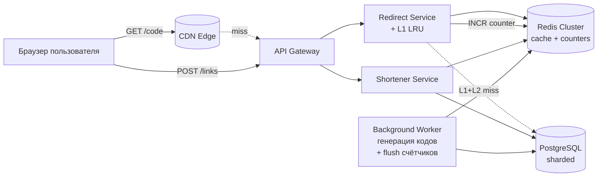
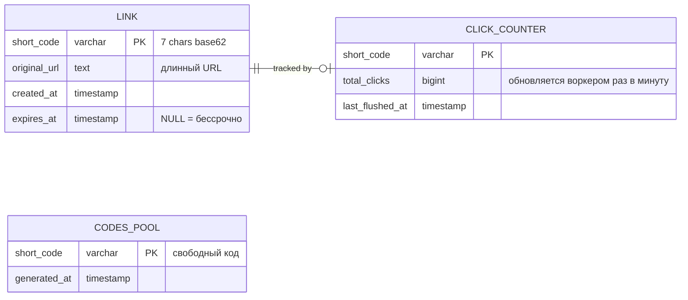
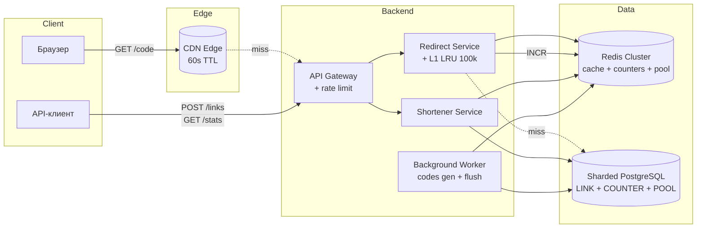
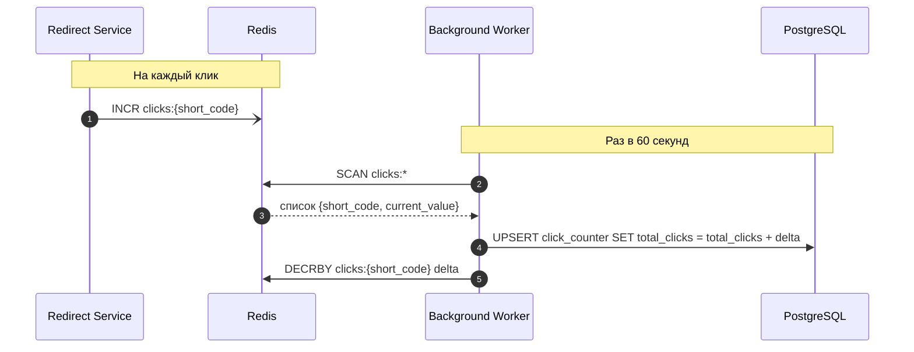
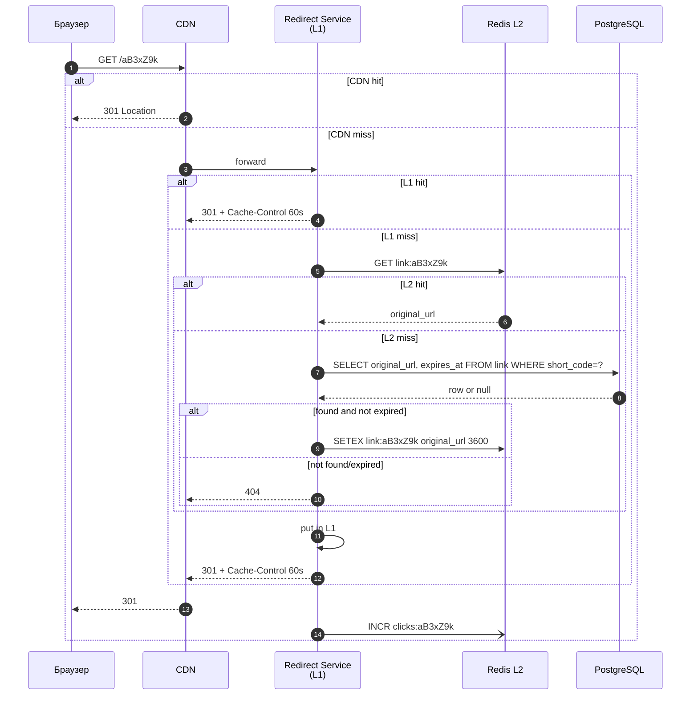
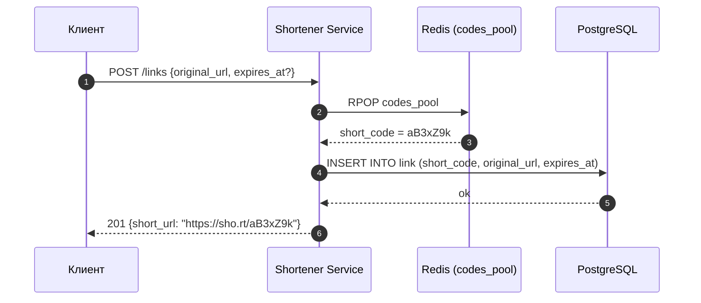
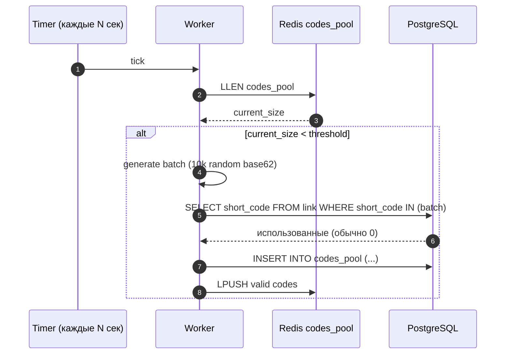
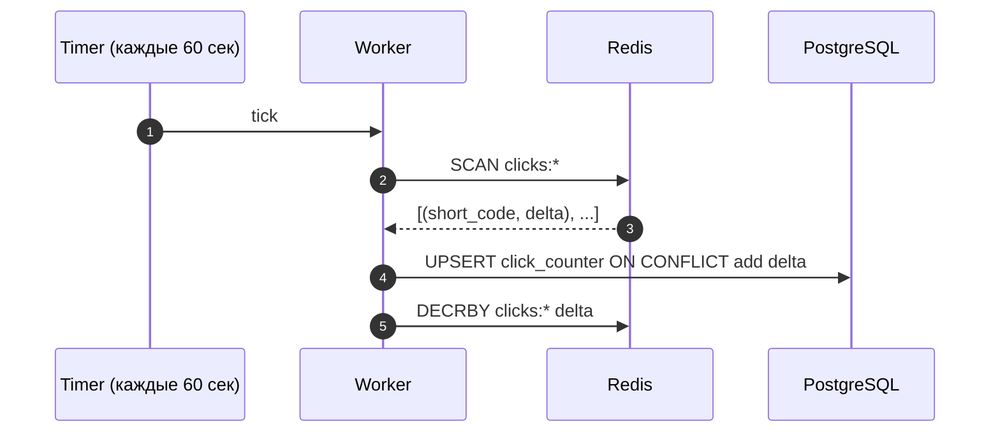
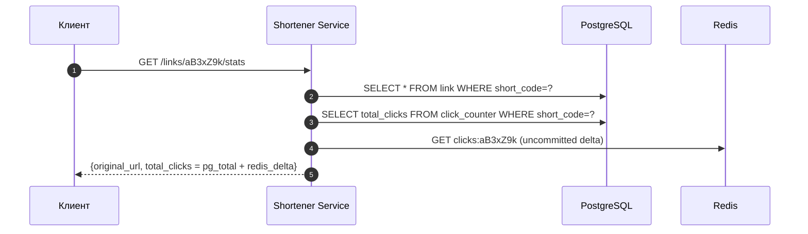

# Техническое решение проекта «URL Shortener»

## 1. Введение

### 1.1. Что это и кому нужно

«URL Shortener» — сервис, превращающий длинный URL в короткую ссылку и выполняющий редирект по этой короткой ссылке. Классические примеры из реального мира — Bitly, TinyURL, `t.co` Twitter/X, `t.me/joinchat/...` Telegram, корпоративные шортенеры маркетинговых отделов.

Типичные сценарии применения:

- **Маркетинговые кампании.** Длинный URL с UTM-метками не помещается в SMS, на наружную рекламу, в QR-код
- **QR-коды на печатных материалах.** Билборды, упаковка, чеки. Сама ссылка живёт годами, ходят по ней миллионами.
- **Шеринг в мессенджерах и соцсетях.** Историческое ограничение Twitter в 140 символов, ограничения SMS, удобство «короткой» ссылки в чате.
- **Внутренние корпоративные ссылки.** Reference на длинные URL внутри Confluence, дашбордов, монорепо.

Общий паттерн нагрузки во всех этих сценариях один и тот же: создаём редко, ходим часто. Соотношение чтения к записи — 20:1 и хуже.

### 1.2. На чём фокусируемся

Главный пользовательский опыт — это момент клика по короткой ссылке. Пользователь не должен заметить, что между его кликом и открытием целевого сайта вообще что-то происходит. Поэтому решение оптимизируется по одной главной метрике:

> Минимальная и предсказуемая латентность редиректа при пиковых нагрузках 200k RPS на чтение.

Ради этой цели делаются сознательные компромиссы во всём, что пользователь напрямую не замечает: точность статистики, скорость распространения истечения ссылки, идемпотентность повторных запросов на создание. Эти компромиссы перечислены явно ниже.

### 1.3. Ограничения по ресурсам разработки

Решение проектируется в реалистичных условиях:

- Команда 3–5 инженеров.
- Бюджет инфраструктуры — никаких ML-сервисов, real-time аналитики.
- Используются стандартные компоненты, которые команда умеет эксплуатировать: PostgreSQL, Redis, NGINX/CDN.
- Отказ от ClickHouse, Kafka, Cassandra на старте.

---

## 2. Система гарантий и ограничений

Явно фиксируем фиксируем, что система гарантирует и от чего отказывается. Дальнейшие решения вытекают из этого контракта.

### 2.1. Гарантируется

| # | Гарантия | Почему критично |
|---|----------|-----------------|
| G1 | Корректность редиректа. Если ссылка существует и не истекла — редирект ведёт ровно на тот URL, который ввёл создатель. | Иначе теряется доверие к сервису. |
| G2 | Сохранность созданных ссылок. Подтверждённая создателем ссылка не теряется, пока не истёк её срок. | Маркетинговая кампания не должна «обвалиться». |
| G3 | Уникальность `short_code`. Один код всегда указывает на ровно один URL за всё время жизни. | Иначе перепутаются переходы разных пользователей. |
| G4 | Низкая латентность редиректа. P95 ≤ 50 мс на стороне сервиса. | Это и есть пользовательский опыт. |
| G5 | Доступность редиректа 99.99 %. | Контур чтения важнее контура записи. |

### 2.2. Не гарантируется (сознательные отказы)

| # | Отказ | Что это значит на практике | Почему допустимо |
|---|-------|----------------------------|------------------|
| R1 | Сильная консистентность статистики. | Счётчик переходов может отставать на минуты от реального числа кликов. | Маркетолог смотрит дашборды раз в день; «±100 кликов» он не заметит. |
| R2 | Точный учёт каждого клика. | Допускается потеря ≤ 0.1 % кликов при сбое узла. | Никакая бизнес-логика не зависит от точного числа кликов. |
| R3 | Мгновенное истечение ссылки. | После `expires_at` ещё до ~60 секунд может работать редирект (TTL кэша). | Маркетолог не указывает срок истечения с точностью до секунды. |
| R4 | Строгая идемпотентность создания. | При сетевом ретрае на `POST /links` теоретически может создаться второй short_code для того же URL. | Создание ссылок — редкая операция; такая «небольшая утечка» в codes pool не критична. |
| R5 | Доступность создания 99.99 %. | SLA контура записи — 99.9 %. | Маркетолог переживёт пару минут даунтайма создания, конечный пользователь — нет. |
| R6 | Детальная аналитика. | Только `total_clicks`, без geo/device/referrer. | Это уже следующий продукт. |
| R7 | Кастомные домены, A/B, branded slugs. | Только автогенерируемые коды на одном домене `sho.rt`. | Вне MVP. |

Эта таблица — фундамент всех дальнейших решений. Если возникает вопрос «а что если…», ответ ищется в ней: случай, покрытый R1–R7 — это сознательный компромисс, а не баг.

---

## 3. Глоссарий

| Термин | Определение |
| --- | --- |
| Original URL | Исходный длинный адрес. |
| Short URL | Короткая ссылка вида `https://sho.rt/{short_code}`. |
| Short code | Короткий идентификатор, 7 символов из base62-алфавита (`a–z`, `A–Z`, `0–9`). |
| Redirect | HTTP 301/302 на исходный URL. |
| Hot key | `short_code`, дающий аномально большую долю трафика. |
| Codes Pool | Предсгенерированный пул свободных `short_code`, FIFO-очередь. |
| TTL | Time-to-live для записи в кэше. |
| L1 / L2 | Локальный (в памяти процесса) / распределённый (Redis) уровни кэша. |

---

## 4. Функциональные требования

1. Создание короткой ссылки. `POST /links` принимает `original_url` и опциональный `expires_at`, возвращает `short_url`.
2. Редирект. `GET /{short_code}` отдаёт HTTP 301 на исходный URL. Если ссылки нет или она истекла — 404.
3. Статистика. `GET /links/{short_code}/stats` возвращает `total_clicks`. Eventual consistency допустима.

Юзеры, авторизация, кастомные slugs, аналитика вне MVP (R6, R7).

---

## 5. Нефункциональные требования

| Метрика | Значение |
|---|---|
| RPS на запись | 10 000 пик |
| RPS на редирект | 200 000 пик |
| Read/Write | ≈ 20:1 |
| P95 редирект | ≤ 50 мс |
| P95 создание | ≤ 100 мс |
| P95 статистика | ≤ 200 мс |
| SLA редирект | 99.99 % |
| SLA запись и статистика | 99.9 % |

---

## 6. Основные компоненты и их функции

Состав системы — 6 компонентов плюс CDN.

| # | Компонент | Функции | Не делает |
|---|-----------|---------|-----------|
| 1 | CDN | Кэширует HTTP-ответ `301 Location: …` на edge-узлах на 60 секунд. Первая линия обороны от hot keys. | Не обращается к БД. |
| 2 | API Gateway | TLS-терминация, rate limiting на запись, маршрутизация. | Не кэширует данные. |
| 3 | Redirect Service | Обслуживает `GET /{short_code}`. Локальный L1 LRU-кэш на ~100k горячих ключей. При промахе — Redis (L2), при промахе там — PostgreSQL. Делает `INCR` счётчика в Redis fire-and-forget. | Не пишет в PostgreSQL. Не агрегирует статистику. |
| 4 | Shortener Service | Обслуживает `POST /links` и `GET /links/{code}/stats`. Берёт код из пула, пишет в PostgreSQL. Для статистики читает счётчик из Redis и метаданные из PG. | Не обслуживает редиректы. |
| 5 | Redis Cluster | Три роли: (а) L2-кэш маппинга `short_code → original_url`, TTL=1ч, (б) счётчики кликов через атомарный `INCR`, (в) очередь свободных кодов пула. | Не источник правды. |
| 6 | PostgreSQL (sharded) | Источник правды: маппинг ссылок, codes pool, durable-копия счётчиков. Шардирование по `hash(short_code)`. | Не обслуживает hot-path редиректа напрямую — только при cache miss. |
| 7 | Background Worker | (1) Пополняет codes pool. (2) Раз в минуту сливает счётчики из Redis в PostgreSQL. | Не участвует в обработке клиентских запросов. |

Контур чтения (Redirect Service) и контур записи (Shortener Service) — это разные процессы, разные пулы машин, разные SLA. Между сервисами нет очередей и брокеров. Связь Redis ↔ PostgreSQL обеспечивает только Background Worker по таймеру; потеря данных в окне между flush-ами покрывается R2.

PostgreSQL находится за тремя слоями кэша (CDN, L1, L2). К нему доходят проценты от исходных 200k RPS.

### 6.1. Уровень детализации компонентов

| Компонент | Что прорабатывается | Что вынесено за рамки |
|---|---|---|
| CDN | Managed-провайдер (Cloudflare/Fastly), cache 60 с на ответе редиректа | Свой edge-кластер |
| API Gateway | NGINX или managed (AWS API GW) с rate limit | Свой gateway |
| Redirect Service | Stateless Go-сервис, L1 — in-process LRU (`freecache`/`bigcache`) | Кастомный shared memory |
| Shortener Service | Тот же стек, CRUD | Свой алгоритм генерации кодов (заменён на пул) |
| Redis | Один шардированный кластер на 3–6 узлов | Отдельные Redis под кэш и под счётчики |
| PostgreSQL | 4–8 шардов с одной репликой каждый, по `hash(short_code)` | Кросс-шардовые транзакции, 2PC, distributed SQL (CockroachDB/Yugabyte) — не требуются: единственный ключ доступа — `short_code` |
| Background Worker | Cron-подобный воркер на том же стеке | Event-driven pipeline, ClickHouse |

---

## 7. Пользовательские сценарии

### 7.1. Переход по короткой ссылке

1. Браузер делает GET на ближайший CDN-edge по адресу `https://sho.rt/{short_code}`.
2. CDN в 60–80 % случаев отдаёт закэшированный `301 Location: …` без обращения к бэкенду.
3. Иначе запрос проходит в Redirect Service, который последовательно проверяет L1 (in-memory), L2 (Redis), PostgreSQL.
4. Браузер получает 301 и переходит на исходный сайт.
5. Параллельно (fire-and-forget) увеличивается счётчик в Redis.

### 7.2. Создание короткой ссылки

1. Клиент шлёт `POST /links {original_url, expires_at?}`.
2. Shortener Service делает `RPOP` из очереди кодов в Redis.
3. Вставляет запись в PostgreSQL.
4. Возвращает `short_url`.

### 7.3. Просмотр статистики

1. Клиент шлёт `GET /links/{short_code}/stats`.
2. Shortener Service читает `total_clicks` из PostgreSQL и текущую дельту из Redis, суммирует.
3. Возвращает результат. Лаг до минуты допустим (R1).

---

## 8. Модель данных

Используются только денормализованные таблицы; на горячем пути отсутствуют JOIN-ы.

### 8.1. Размещение данных по хранилищам

| Сущность | Хранилище | Назначение |
|---|---|---|
| `LINK` (источник правды) | PostgreSQL, шардирование по `hash(short_code)` | Долгоживущие данные, индексы. |
| `LINK` (горячая копия) | Redis L2: `link:{short_code}` → `original_url`, TTL=1ч | Мгновенный read. |
| `CODES_POOL` (мастер) | PostgreSQL, отдельная таблица | Источник правды о свободных кодах. |
| `CODES_POOL` (рабочая очередь) | Redis LIST: `codes_pool` | Атомарный `RPOP` за O(1). |
| `CLICK_COUNTER` (live) | Redis: `clicks:{short_code}` через `INCR` | Атомарный инкремент < 1 мс. |
| `CLICK_COUNTER` (durable) | PostgreSQL, таблица `click_counter` | Долговечная копия после flush. |

### 8.2. Свойства модели

- На горячем пути редиректа выполняется только лукап по PK.
- Маппинг `LINK` иммутабелен после создания: `original_url` никогда не меняется. Инвалидация кэша не требуется, только TTL по истечении ссылки.
- Счётчик отделён от строки `LINK`: каждый клик не обновляет таблицу `LINK`, что снимает потолок на запись в PostgreSQL.

### 8.3. Генерация `short_code` и пул

Алгоритм:

1. Background Worker генерирует случайные строки длиной 7 символов в base62 (62⁷ ≈ 3.5 × 10¹² комбинаций).
2. Выполняется анти-коллизионная проверка батчем (LEFT ANTI JOIN с `LINK`).
3. Валидные коды записываются в таблицу `CODES_POOL` в PostgreSQL и одновременно через `LPUSH` помещаются в Redis-список.
4. В момент `POST /links` Shortener Service делает `RPOP` из Redis — получает гарантированно свободный код за O(1).

Свойства:

- На hot path записи отсутствуют retry на коллизию.
- Латентность создания детерминирована.
- При неуспешной вставке (например, дубль) код возвращается в пул через `LPUSH`. Утечка кода из 3.5 трлн комбинаций допустима по R4.

### 8.4. Шардирование

Шардируется только `LINK` по `hash(short_code)`:

- Роутинг тривиален: шард вычисляется из ключа запроса.
- Cross-shard операций нет: все запросы — point lookup или insert по PK.
- Горизонтальное расширение через consistent hashing.

`CODES_POOL` и `CLICK_COUNTER` не шардируются: малый объём, отсутствие необходимости.

---

## 9. Архитектура

### 9.1. Многоуровневый кэш

Поскольку маппинг иммутабелен (§8.2), допустимо агрессивное кэширование без сложной инвалидации.

| Уровень | Где | Время доступа | Hit rate | Эффект |
|---|---|---|---|---|
| L0 | CDN edge | 1–5 мс RTT | 60–80 % | Топ-ссылки не доходят до бэкенда |
| L1 | In-memory LRU (100k записей) | < 1 мс | 85–95 % от L0 miss | Защита Redis от hot key |
| L2 | Redis Cluster, TTL 1ч | 1–2 мс | 95 %+ от L1 miss | Шаринг кэша между инстансами |
| L3 | PostgreSQL | 5–20 мс | редко | Source of truth |

Эффективная нагрузка на PostgreSQL: 200–2000 RPS из исходных 200 000 RPS на чтение.

### 9.2. Счётчики кликов: Redis `INCR` + периодический flush

Свойства:

- `INCR` — атомарная операция Redis, латентность < 1 мс, не требует блокировок, выдерживает 200k RPS.
- Flush раз в минуту — батч на тысячи `short_code` в одном UPSERT в PostgreSQL.
- При сбое Redis теряется незалитая часть счётчика (клики за окно до 60 секунд). Покрывается R2.

### 9.3. Hot keys

Защита трёхступенчатая:

1. CDN кэширует ответ редиректа на 60 секунд. Для вирусной ссылки 99 % её трафика обслуживается на edge.
2. L1 LRU в каждом инстансе Redirect Service размером 100k записей. Топ-ключи прибиваются в локальной памяти.
3. Read-реплики Redis для горизонтального масштабирования чтения.

Итог: трафик вирусной ссылки почти не доходит до Redis-шарда.

---

## 10. Технические сценарии

### 10.1. Редирект (hot path, 200k RPS)

Свойства:

- При hot key бэкенд не обрабатывает запрос.
- L1 hit формирует ответ за ≈ 1 мс.
- `INCR` выполняется после отправки ответа и не блокирует редирект.

### 10.2. Создание ссылки

Запись без блокировок, без retry, без race conditions: код зарезервирован в пуле до запроса.

### 10.3. Пополнение пула

Анти-коллизионная проверка выполняется офлайн от hot path записи.

### 10.4. Сброс счётчиков

### 10.5. Просмотр статистики

Возвращается сумма закоммиченного счётчика и текущей дельты в Redis: near-realtime без риска потери при перезапуске Redis (закоммиченная часть уже в PostgreSQL).

---

## 11. Обоснование решений и компромиссы

### 11.1. Обязательные компоненты

| Компонент | Без чего ломается |
|---|---|
| CDN edge cache | При hot key загибается бэкенд. Самый дешёвый и эффективный слой. |
| L1 in-memory кэш | Без него Redis — узкое место по RPS и сети. |
| Redis L2 | Без него каждый L1 miss бьёт в PostgreSQL. |
| Шардирование PostgreSQL | Без него один Postgres не выдерживает запись 10k RPS и поток cache-miss. |
| Codes pool | Без него запись имеет retry на коллизию, латентность не детерминирована. |
| Background Worker для счётчиков | Без него либо теряются клики, либо PostgreSQL ложится под 200k RPS write. |

### 11.2. Сознательные отказы

| Отказ | Выигрыш | Потеря | Компенсация |
|---|---|---|---|
| Kafka между сервисами | Меньше компонентов в эксплуатации | Нет «магистрали» для будущей аналитики | Текущая архитектура не блокирует апгрейд |
| ClickHouse для CLICK_EVENT | Одно хранилище вместо двух | Нет детальной поклик-аналитики | Соответствует R6 |
| Stats Aggregator как отдельный сервис | Меньше деплоев | Flush-логика — внутри Background Worker | Реализация эквивалентна |
| Идемпотентность создания | Нет unique-индекса и логики дедупликации | Сетевой ретрай может создать дубль-ссылку | R4: утечка из 3.5 трлн кодов допустима |
| Сильная консистентность счётчика | Redis `INCR` + батч-flush | Лаг 1 мин в статистике | R1 |
| Multi-region active-active | Меньше операционной сложности | При фейле региона — недоступность в нём | CDN глобален, single-region достаточно для 99.99 % на чтение |

### 11.3. Стоимость выбранной стратегии

- Память L1: 100k записей × 200 байт × 12 инстансов ≈ 240 МБ суммарно.
- Дублирование данных: `LINK` живёт в PostgreSQL и в Redis, `COUNTER` — там же. Цена за денормализацию и скорость.
- Возможная потеря ≤ 0.1 % кликов при сбое Redis (R2).
- Лаг счётчика до 1 минуты (R1).

### 11.4. Итоговые характеристики

- 6 компонентов плюс CDN.
- P95 редирект ≤ 50 мс при 200k RPS за счёт каскада кэшей.
- Hot path защищён трёхступенчато: CDN, L1, L2.
- Создание ссылок детерминированно по латентности.
- Статистика — eventual consistency при минимальной нагрузке на БД.
- Компромиссы R1–R7 управляемые и описанные.

---

## 12. Точки роста

Архитектура расширяется без переписывания hot path:

- Детальная аналитика — Kafka между Redirect Service и аналитическим хранилищем (ClickHouse). Redirect Service не меняется.
- Кастомные домены и branded slugs — изменения только в Shortener Service.
- Multi-region — CDN уже глобален; Redis и PostgreSQL получают read-replica в нужных регионах.
- Anti-abuse / phishing detection — отдельный async-сервис проверяет URL при создании.
