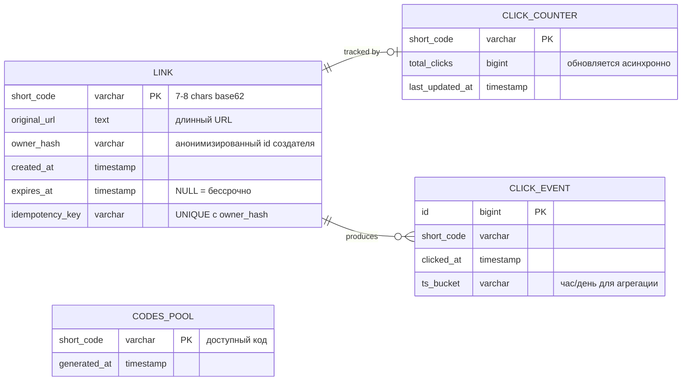
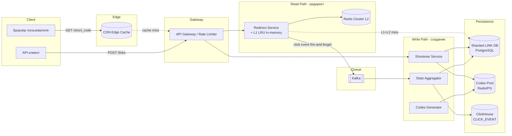
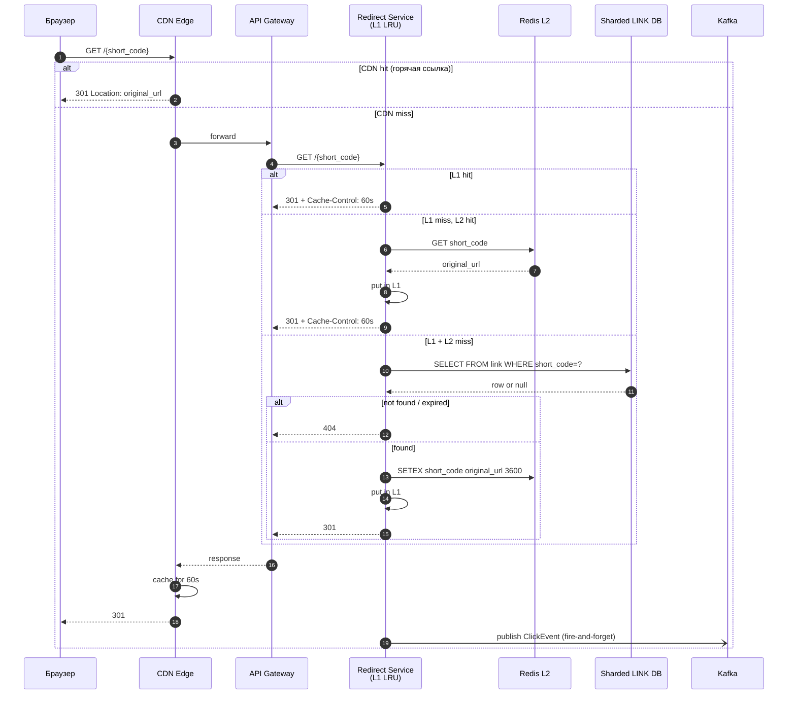
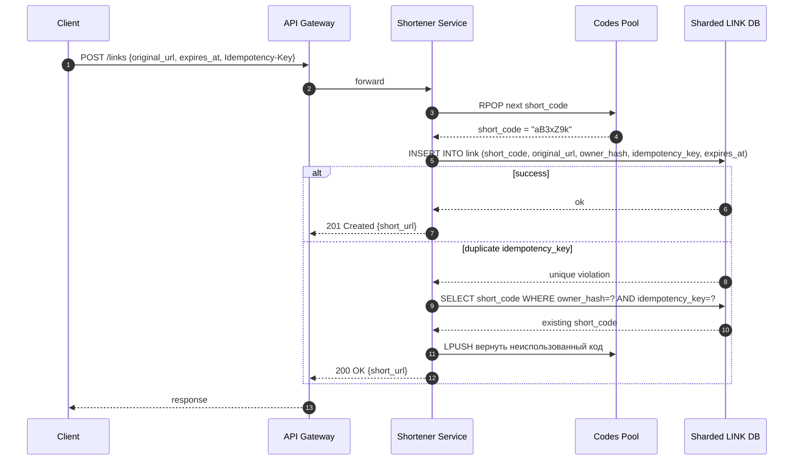
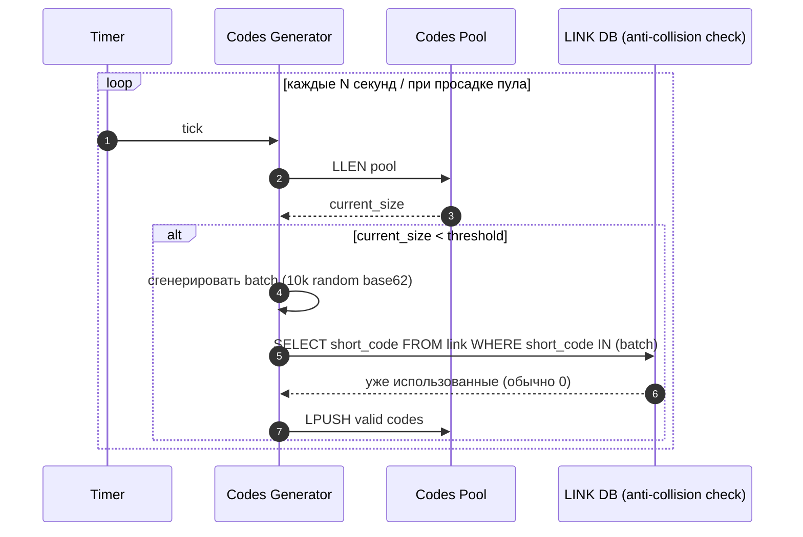
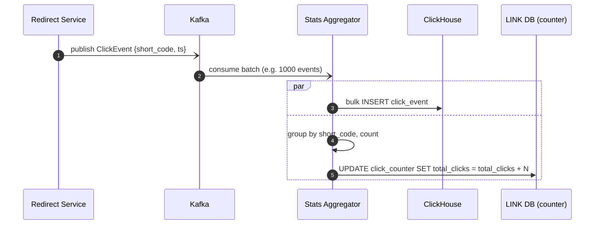
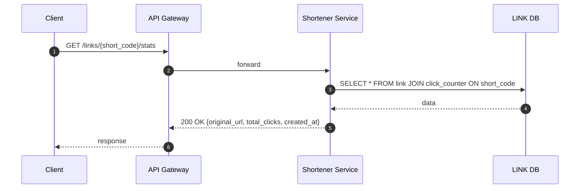

# Техническое решение проекта «URL Shortener»

## 1. Введение

«URL Shortener» — это высоконагруженный сервис сокращения ссылок, который позволяет пользователю преобразовать длинный URL в короткую ссылку и при переходе по ней мгновенно получить redirect на исходный адрес. Ключевая характеристика системы — резкий перекос нагрузки в сторону чтения (≈ 20 read на 1 write) и наличие «горячих» ссылок, по которым выполняется непропорционально большое число переходов.

Архитектура спроектирована с акцентом на **скорость отклика и пропускную способность редиректа** как на главный пользовательский опыт. Сознательно допускаются компромиссы в области сильной консистентности (статистика переходов — eventual consistency, кэш ссылок — TTL-устаревание на единицы секунд), поскольку их влияние на пользовательский опыт пренебрежимо мало, а выигрыш в латентности и стоимости решения — значителен.

---

## 2. Глоссарий

| Термин | Определение |
| --- | --- |
| Original URL | Исходный длинный адрес, на который должен происходить переход. |
| Short URL | Короткая ссылка, созданная системой, в формате `https://sho.rt/{short_code}`. |
| Short code (slug) | Короткий уникальный идентификатор ссылки, 7–8 символов из base62-алфавита. |
| Redirect | HTTP 301/302 перенаправление пользователя с короткой ссылки на исходный URL. |
| Expiration time | Момент времени, после которого ссылка считается недействительной. |
| Collision | Ситуация, когда двум разным запросам пытаются назначить один и тот же short code. |
| Hot key | Очень популярная короткая ссылка, по которой выполняется непропорционально много переходов в единицу времени. |
| Idempotency Key | Уникальный идентификатор запроса от клиента, позволяющий безопасно повторить запрос без создания дубликатов. |
| Codes Pool | Предварительно сгенерированный пул свободных short_code, из которого приложение берёт коды атомарно. |
| TTL | Time-to-live для записи в кэше. |
| CDN | Сеть распределённых edge-узлов, кэширующих ответы ближе к пользователю. |

---

## 3. Функциональные требования

1. **Создание короткой ссылки.** Пользователь передаёт длинный URL и опционально срок действия, получает короткую ссылку. Поддерживаются HTTP/HTTPS ссылки.
2. **Редирект по короткой ссылке.** При обращении к `GET /{short_code}` система выполняет HTTP redirect на исходный URL. Для несуществующих и истёкших ссылок возвращается 404.
3. **Уникальность коротких идентификаторов.** Один `short_code` всегда указывает на ровно один исходный URL за всё время жизни.
4. **Срок действия ссылки.** Поддерживаются бессрочные ссылки и ссылки с TTL; после истечения redirect не выполняется.
5. **Базовая статистика.** По идентификатору ссылки можно получить общее число переходов. Допускается eventual consistency.

### Архитектурные принципы

1. **Read-first design.** Главный приоритет — латентность и доступность редиректа. Всё остальное (создание, статистика) допускает более высокие задержки и более слабые гарантии.
2. **Pre-generated codes pool.** `short_code` не генерируется «на лету» во время записи, а берётся атомарно из заранее заполненного пула. Это убирает race condition на этапе создания и убирает retry-цикл из горячего пути записи.
3. **Идемпотентность создания.** На уникальной паре `(user_hash, idempotency_key)` гарантируется отсутствие дубликатов. Повторный запрос возвращает ранее созданный short_code.
4. **Immutable mapping.** После создания связь `short_code → original_url` не меняется. Это позволяет агрессивно кэшировать её на всех уровнях (вплоть до CDN).

---

## 4. Нефункциональные требования

- **Высокие нагрузки (Highload Metric Targets):**
  - Запись (создание ссылок): до **10 000 RPS** в пике.
  - Чтение (редиректы): до **200 000 RPS** в пике.
  - Соотношение read/write: ≈ **20:1** — read-heavy профиль.
  - Наличие «горячих» ссылок: одна ссылка может давать до 10–20 % всего трафика.
- **Производительность (P95 Latency):**
  - Редирект: **≤ 50 мс** на стороне сервиса (без учёта загрузки конечного сайта).
  - Создание ссылки: **≤ 100 мс**.
  - Чтение статистики: **≤ 150–200 мс**.
- **Доступность:**
  - Контур редиректа: **99.99 %** (приоритетный SLA).
  - Контур создания и статистики: **99.9 %**.
- **Надёжность и корректность:**
  - Отсутствие потери уже подтверждённых (созданных) ссылок.
  - Идемпотентность при сетевых ретраях на создание.
  - Один `short_code` не может ссылаться на два разных URL.
- **Консистентность:**
  - `short_code → original_url`: фиксируется надёжно, допустима задержка распространения по кэшам до **5 секунд** (TTL).
  - Статистика переходов: **eventual consistency**, лаг до **минуты** допустим.

---

## 5. Пользовательские сценарии

### Сценарий: создание короткой ссылки

1. Пользователь отправляет в API запрос `POST /links` с полем `original_url` и опциональным `expires_at`, прикладывая `Idempotency-Key`.
2. Система выдаёт короткий идентификатор из пула, сохраняет соответствие.
3. Пользователь получает в ответе `short_url` и метаданные.

### Сценарий: переход по короткой ссылке

1. Пользователь открывает короткую ссылку в браузере: `GET https://sho.rt/{short_code}`.
2. Система определяет исходный URL.
3. Браузер пользователя получает HTTP 301/302 и переходит на исходный сайт.
4. Если ссылка не существует или истекла — возвращается 404.

### Сценарий: просмотр статистики

1. Пользователь запрашивает `GET /links/{short_code}/stats`.
2. Система возвращает общее число переходов и метаданные ссылки.

---

## 6. Модель данных

### 6.1. Основные сущности

1. **`LINK`** — иммутабельное соответствие `short_code → original_url`. Главная и единственная критичная таблица для редиректа. Может быть прочитана только по PK, что делает доступ всегда O(1) по индексу.
2. **`CODES_POOL`** — пул заранее сгенерированных, ещё не использованных коротких кодов. Используется как очередь FIFO. Полностью убирает коллизии: код не назначается двум запросам, потому что каждый запрос получает строку из пула атомарно (`SELECT ... FOR UPDATE SKIP LOCKED` или `RPOP` в Redis).
3. **`CLICK_COUNTER`** — денормализованный счётчик переходов, обновляемый асинхронно из потока кликов. Используется для быстрой выдачи статистики.
4. **`CLICK_EVENT`** — поток событий кликов (хранится в аналитическом хранилище ClickHouse). Используется как источник для пересчёта счётчиков и для возможной будущей детальной аналитики.

### 6.2. Генерация short_code

Кодогенератор работает **офлайн от горячего пути записи** и наполняет `CODES_POOL`. Это даёт три выгоды:

- Запись `POST /links` не делает retry на коллизию — код уже уникален.
- Можно «прогреть» пул заранее и пережить всплеск создания ссылок.
- Алгоритм генерации можно менять (random base62 / counter+base62 / hash) без воздействия на основной сервис.

Используется **base62 (a–z, A–Z, 0–9)** длиной 7 символов:
62⁷ ≈ 3.5 × 10¹² комбинаций. При 10 000 RPS на запись это десятилетия эксплуатации, и при заполнении даже 1 % пространства вероятность коллизии при случайной генерации остаётся пренебрежимо малой (~10⁻¹⁰), что делает выбор random base62 безопасным.

### 6.3. Идемпотентность

На таблице `LINK` создаётся **Unique Constraint** на `(owner_hash, idempotency_key)`. При повторе запроса от клиента (сетевой retry) PostgreSQL вернёт ошибку дубликата, и приложение отдаст уже существующий `short_code`, не создавая новой записи. Также код, который был «зарезервирован» из пула под этот запрос, возвращается обратно в пул.

### 6.4. Шардирование

Главная таблица `LINK` шардируется **по hash(short_code)** на N шардов PostgreSQL.

- **Почему по short_code, а не по user**: подавляющая часть нагрузки — это GET по short_code; роутинг на нужный шард тривиально вычисляется по самому ключу запроса без обращения к каталогу.
- **Локальность чтения**: запрос на редирект никогда не делает cross-shard fanout.
- **`CLICK_EVENT`** хранится отдельно — в ClickHouse, который сам распределяет данные по своему шардированному кластеру.

---

## 7. Архитектура (Highload Architecture)

Архитектура построена на разделении контуров записи и чтения и на агрессивном многоуровневом кэшировании. Контур редиректа максимально упрощён: фактически от запроса до ответа достаточно одного in-memory lookup при попадании в кэш.

### Основные компоненты

1. **CDN / Edge Cache** — кэширует ответы редиректа на edge-узлах. Большая часть «горячих» ссылок отдаётся прямо из CDN, никогда не доходя до бэкенда. Это первая и самая дешёвая линия обороны.
2. **API Gateway** — точка входа. Делает rate limiting (защита от ботов на создание), TLS-терминацию, базовую аутентификацию для эндпоинтов записи.
3. **Redirect Service** — stateless-сервис, обслуживающий только `GET /{short_code}`. Масштабируется горизонтально, имеет локальный in-memory LRU-кэш для самых горячих ключей (L1).
4. **Shortener Service** — сервис создания ссылок. Работает с пулом кодов и записывает в `LINK`. Горячий путь не содержит retry-циклов.
5. **Codes Generator (фоновый воркер)** — пополняет `CODES_POOL` в фоне, отслеживая глубину пула. При проседании размера пула ниже порога подкачивает новую партию (батч 10–50k кодов за раз).
6. **Redis Cluster (L2 Cache)** — шардированный распределённый кэш для `short_code → original_url` с TTL ≈ 1 час. Шарится между всеми инстансами Redirect Service.
7. **PostgreSQL (Sharded LINK DB)** — источник правды для маппинга. К нему обращаются только при L1+L2 miss.
8. **Kafka** — транспорт для событий кликов (`CLICK_EVENT`) и для outbox-событий `LinkCreated`.
9. **Stats Aggregator** — консумер Kafka, который агрегирует клики в `CLICK_COUNTER` и пишет сырой поток в ClickHouse.
10. **ClickHouse** — аналитическое хранилище для `CLICK_EVENT`. Отвечает за тяжёлые агрегации и масштаб хранения.

### 7.1. Многоуровневое кэширование как ключ к 200k RPS

Поток обработки редиректа спроектирован так, чтобы при «горячем» состоянии система **не трогала ни PostgreSQL, ни Redis** на каждом редиректе:

| Уровень | Где | Что хранит | Время доступа | Hit rate |
| --- | --- | --- | --- | --- |
| L0 | CDN edge | full HTTP 301 response | 1–5 мс (RTT до edge) | до 60–80 % для топ-ссылок |
| L1 | In-memory LRU в Redirect Service | `short_code → original_url` | < 1 мс | ≈ 85–95 % того, что доехало до бэкенда |
| L2 | Redis Cluster | `short_code → original_url`, TTL=1h | 1–2 мс | ≈ 95 %+ от L1 miss |
| L3 | PostgreSQL (Sharded) | source of truth | 5–20 мс | редкие промахи |

Поскольку маппинг **иммутабельный**, инвалидация кэша почти не нужна. Единственный кейс инвалидации — истечение TTL ссылки: после `expires_at` запись помечается как `expired` и при следующем запросе кэши обновляются. До этого момента возможно отдать редирект ещё на короткое время после реального истечения — это явный компромисс в пользу скорости (см. §9).

### 7.2. Обработка hot keys

Без специальной обработки одна «вирусная» ссылка может посадить один шард Redis. Решение:

- **CDN кэширует ответ редиректа на 60 секунд** для всех ссылок. Для топ-ссылки это означает, что 99 % её трафика обслуживается на edge.
- **L1 LRU в каждом инстансе Redirect Service** ёмкостью 100k записей. Топовые ключи фактически «прибиваются» в локальной памяти и никогда не уходят в Redis.
- **Реплики Redis на чтение** в каждом шарде кластера.

### 7.3. Запись кликов: fire-and-forget

При редиректе Redirect Service **не ждёт** записи клика — он публикует событие в Kafka в режиме fire-and-forget (или с маленьким локальным batch-буфером) и сразу отдаёт 301 пользователю. В худшем случае при падении инстанса потеряется маленький буфер кликов — это допустимый компромисс, поскольку статистика всё равно `eventual consistency` и абсолютная точность не требуется (см. ФТ §3.5).

### 7.4. Запись ссылок: атомарное взятие кода из пула

Чтобы убрать race conditions на этапе создания, `Shortener Service` не генерирует код «на лету». Вместо этого:

1. Атомарно достать код из `CODES_POOL` (`RPOP` в Redis, либо `DELETE … RETURNING` с `SKIP LOCKED` в PG).
2. В транзакции БД вставить запись в `LINK`.
3. Если `idempotency_key` уже был, поймать unique violation — вернуть существующий `short_code`, а взятый из пула код вернуть обратно (`LPUSH`).

Это обеспечивает **корректность без блокировок** на самой `LINK` и без retry-циклов.

---

## 8. Контракты API и Технические сценарии

### 8.1. API

| Метод | Путь | Описание |
| --- | --- | --- |
| `POST` | `/links` | Создать короткую ссылку. Заголовок `Idempotency-Key` обязателен. |
| `GET` | `/{short_code}` | Редирект (HTTP 301/302). |
| `GET` | `/links/{short_code}/stats` | Получить статистику. |

### 8.2. Сценарий: редирект (200k RPS, главный hot path)

Ключевые свойства:

- При hot key реальный бэкенд **вообще не трогается** — отвечает CDN.
- При L1 hit ответ внутри бэкенда формируется за ~1 мс.
- Запись клика **не блокирует** ответ пользователю.

### 8.3. Сценарий: создание короткой ссылки

### 8.4. Сценарий: пополнение пула кодов (фоновый процесс)

Anti-collision check выполняется **на пополнении пула**, а не в горячем пути записи. Это снимает с критического пути коллизионную проверку.

### 8.5. Сценарий: учёт клика и обновление статистики (CQRS / eventual)

Stats Aggregator работает батчами — это позволяет одной транзакцией обновить счётчик по тысячам кликов сразу, а не делать UPDATE на каждый клик.

### 8.6. Сценарий: получение статистики

---

## 9. Обоснование архитектурных решений и компромиссы

### 9.1. Почему такая архитектура

| Решение | Почему выбрано |
| --- | --- |
| **Разделение Redirect / Shortener Service** | Они имеют принципиально разные SLA (99.99 % vs 99.9 %), разные паттерны нагрузки (200k RPS read vs 10k RPS write) и разную ёмкость. Их раздельное масштабирование — самый дешёвый способ держать 200k RPS на чтение. |
| **CDN + L1 + L2 кэш** | Иммутабельность маппинга позволяет кэшировать максимально агрессивно. Большая часть трафика обслуживается до того, как доходит до бэкенда. |
| **Pre-generated Codes Pool** | Убирает retry-цикл и блокировки на горячем пути записи. Делает запись детерминированной по латентности. |
| **Шардирование по hash(short_code)** | Запросы на чтение всегда идут на нужный шард по самому ключу — без каталога и без fanout. |
| **Kafka + fire-and-forget на клики** | Развязывает критичный путь редиректа от записи статистики. Даже если ClickHouse временно недоступен — редиректы продолжают работать. |
| **ClickHouse для CLICK_EVENT** | Линейная масштабируемость по объёму, быстрые агрегации. PostgreSQL такой профиль записи (десятки тысяч инсертов в секунду длинного потока) не вытянет экономично. |

### 9.2. Сознательные компромиссы

| Компромисс | Что теряем | Что выигрываем | Почему допустимо |
| --- | --- | --- | --- |
| **Eventual consistency статистики** | До минуты лага в показанном значении total_clicks | Возможность батч-обновления и развязка с горячим путём | Пользователь не принимает решений на разнице в 100 кликов; точность «±1 мин» — норма для аналитики. |
| **Fire-and-forget кликов** | Возможна потеря маленького буфера (~сотни кликов) при падении инстанса | -10–20 мс P95 на редиректе, отсутствие зависимости от Kafka | Статистика всё равно неточна по дизайну; для UX потеря 0.001 % кликов незаметна. |
| **TTL-кэш до 1 часа** | После «истечения» ссылки ещё какое-то время может отдаваться 301 | Резкое снижение нагрузки на БД | Эксплуатационно безопасно (нет финансовых рисков); явно фиксируется в SLA. |
| **L1 LRU в каждом инстансе** | Удвоение/утроение памяти по сравнению с одним общим кэшем | Полный отказ от сетевого hop для топ-ключей | Память дешевле сети при таких RPS. |
| **301 redirect (а не 302)** | Браузер может закэшировать редирект и не сообщить нам о повторных переходах | Меньше нагрузки на сервис | Точное соответствие выбранной стратегии «eventual stats»; для критичной аналитики можно перейти на 302. |
| **Round-robin / hash шардирование без переноса данных** | При добавлении шардов часть ключей нужно перебалансировать | Простота операционной модели | Используем consistent hashing на роутинге, чтобы минимизировать долю мигрирующих ключей. |

### 9.3. Что сознательно НЕ делаем (для упрощения)

- Не делаем кастомные домены, A/B-тестирование, QR-генерацию — вне ФТ.
- Не делаем детальную аналитику (geo, referrer, device) на MVP — только total_clicks. Расширяется без изменения архитектуры за счёт `CLICK_EVENT` в ClickHouse.
- Не используем 2PC для cross-shard операций — все таблицы шардируются по одному ключу `short_code`, поэтому распределённых транзакций нет в принципе.
- Не делаем active-active мульти-региональную репликацию — на этапе MVP single-region достаточно для целевых SLA.

### 9.4. Точки роста и узкие места

- **Самое узкое место** — Redis L2 на запись (инвалидация при создании ссылки и заполнение). При 10k RPS на запись это легко тянется одним кластером Redis на 3–6 шардов.
- **Следующее узкое место** — PostgreSQL на запись в `LINK`. Решается шардированием на 8–16 узлов и батч-инсертами при пакетном создании.
- **Будущая горизонталь** — при росте >500k RPS на редирект имеет смысл вынести Redirect Service в edge-функции (Cloudflare Workers / Fastly Compute), где он будет жить прямо рядом с CDN.

---

## 10. Итоговая характеристика решения

Решение спроектировано как **read-optimized highload система**, в которой основной пользовательский опыт — мгновенный редирект — обслуживается преимущественно edge-слоем и in-memory кэшем, а более «холодные» сценарии (создание ссылок, статистика) обслуживаются стандартными транзакционными и аналитическими хранилищами. Сознательные компромиссы в области строгой консистентности статистики и точности учёта кликов выбраны в пользу низкой латентности и операционной простоты, что соответствует характеру задачи URL Shortener.
