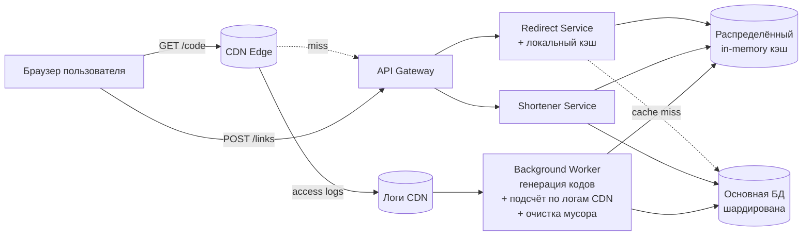
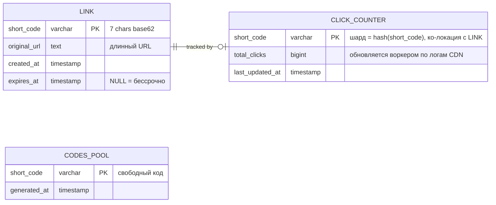
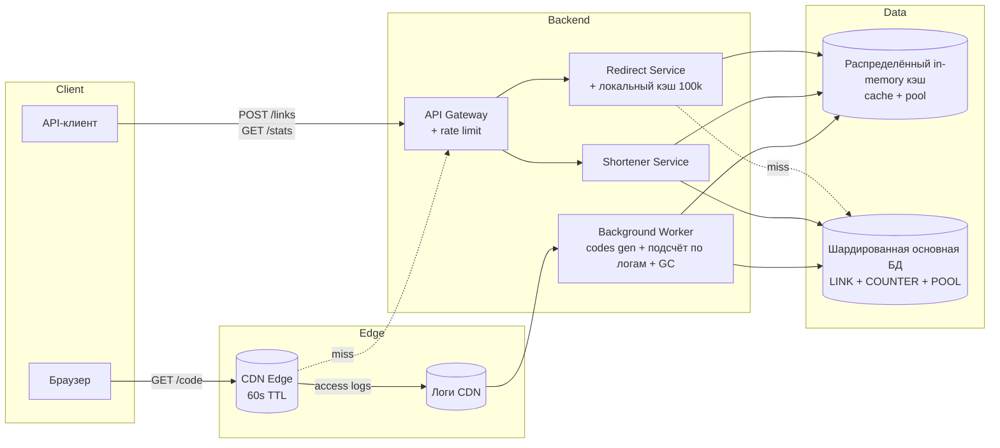
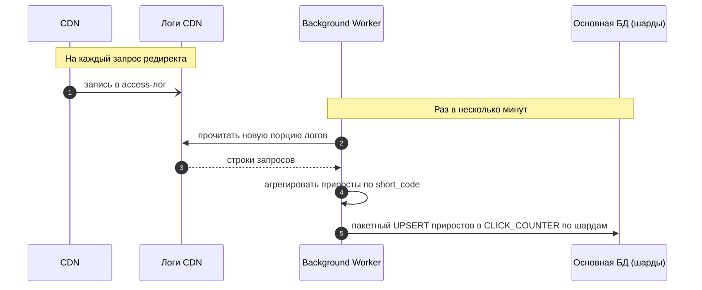
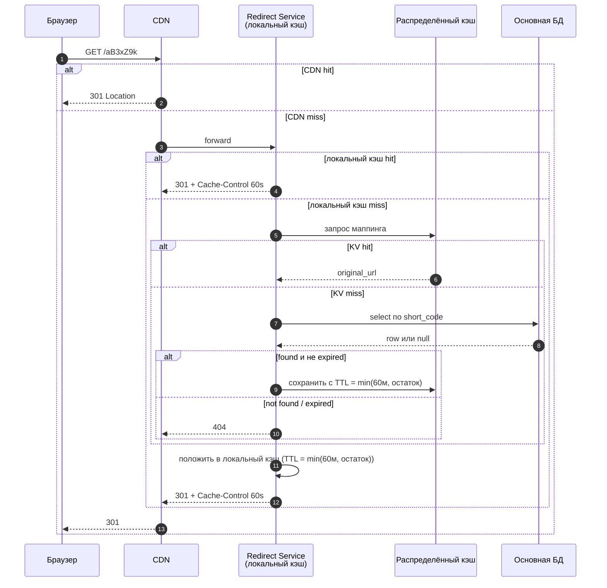
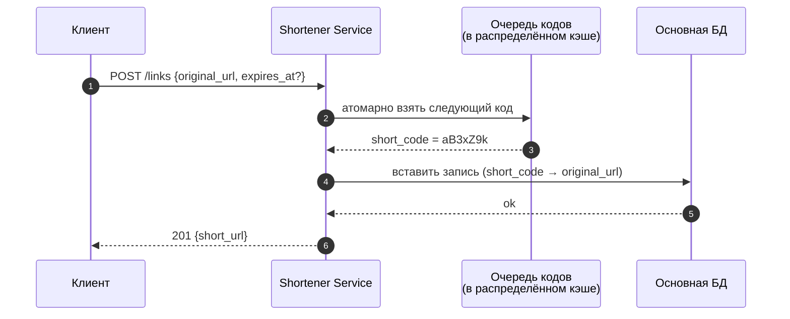
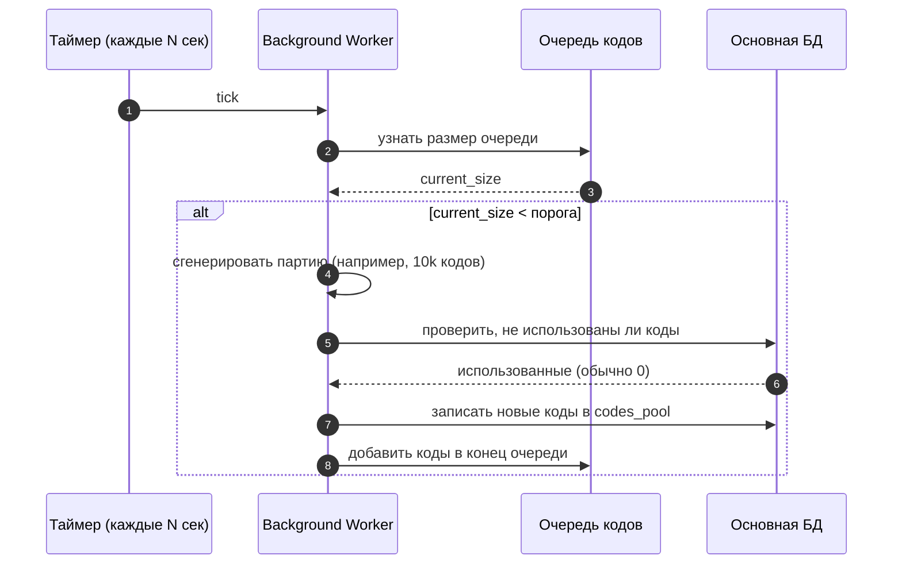
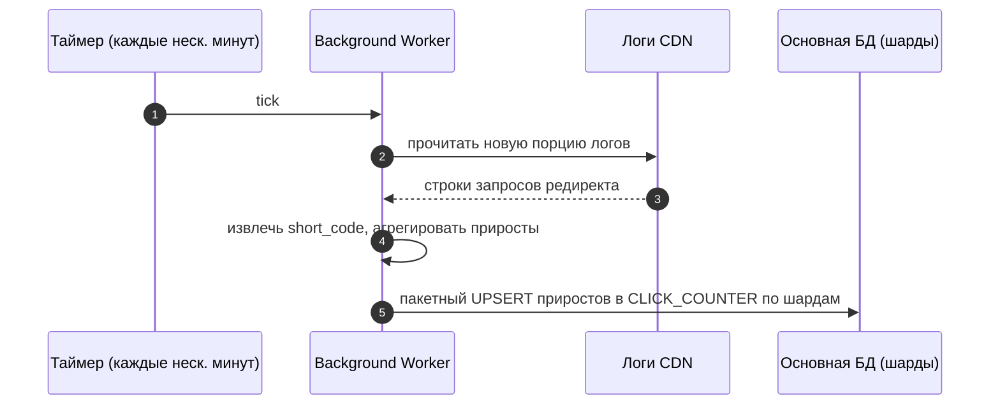
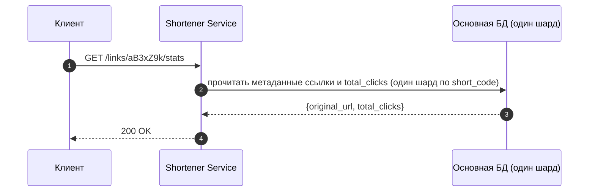

# Техническое решение проекта «URL Shortener»

## 1. Введение

«URL Shortener» — сервис, преобразующий длинный URL в короткую ссылку формата `https://sho.rt/{short_code}` и выполняющий HTTP-редирект при переходе по короткой ссылке. Целевые сценарии применения — маркетинговые ссылки с UTM-метками, QR-коды на печатных материалах, шеринг в мессенджерах, корпоративные внутренние ссылки. Во всех сценариях профиль нагрузки одинаков: запись редкая, чтение интенсивное, отношение read/write — 20:1 и хуже.

Решение оптимизируется по одной главной метрике — **минимальная и предсказуемая латентность редиректа при пиковой нагрузке 200k RPS на чтение**. Ради этого допускаются сознательные компромиссы по точности статистики, гранулярности истечения ссылок и идемпотентности создания (см. §2.2).

Ресурсные ограничения проекта: команда 3–5 инженеров, MVP за квартал, стандартный технологический стек (реляционная БД, распределённый in-memory кэш, CDN). На старте отсутствуют узкоспециализированные компоненты — брокер сообщений, аналитическое хранилище, мульти-региональная репликация. Архитектура спроектирована так, чтобы добавление этих компонент в будущем не требовало переписывания горячего пути редиректа (§12).

---

## 2. Система гарантий и ограничений

Контракт сервиса фиксируется заранее: гарантии (G1–G5) и сознательные отказы (R1–R7) определяют все последующие архитектурные решения.

### 2.1. Гарантии

| # | Гарантия | Обоснование |
|---|----------|-------------|
| G1 | Корректность редиректа: для существующей не истёкшей ссылки переход ведёт на исходный URL без искажений | базовое доверие к сервису |
| G2 | Сохранность подтверждённых ссылок до момента истечения `expires_at` | устойчивость маркетинговых кампаний |
| G3 | Уникальность `short_code` на всём времени жизни — один код соответствует ровно одному URL | отсутствие коллизий в пользовательских переходах |
| G4 | P95 редиректа ≤ 50 мс на стороне сервиса | пользовательский опыт |
| G5 | Доступность контура редиректа 99.99 % | приоритет контура чтения над записью |

### 2.2. Отказы

| # | Отказ | Практическое следствие | Обоснование допустимости |
|---|-------|------------------------|--------------------------|
| R1 | Сильная консистентность статистики | лаг счётчика до нескольких минут (период разбора логов CDN) | дашборды смотрятся раз в день, погрешность в десятки кликов незаметна |
| R2 | Точный учёт каждого клика | возможна потеря части кликов при сбое выгрузки логов CDN | бизнес-логика не зависит от точного числа кликов |
| R3 | Мгновенное истечение ссылки | после `expires_at` редирект может работать до 60 с (TTL CDN) | срок истечения не указывается с секундной точностью |
| R4 | Строгая идемпотентность создания | сетевой ретрай `POST /links` может создать дубль-ссылку | создание — редкая операция без побочных эффектов; рост мусора контролируется (§8.5) |
| R5 | Доступность контура записи 99.99 % | SLA записи — 99.9 % | даунтайм создания не виден конечным пользователям |
| R6 | Детальная аналитика | только `total_clicks`, без geo/device/referrer | вне MVP |
| R7 | Кастомные домены, branded slugs, A/B | один домен, автогенерируемые коды | вне MVP |

---

## 3. Глоссарий

| Термин | Определение |
| --- | --- |
| Original URL | Исходный длинный адрес |
| Short URL | Короткая ссылка вида `https://sho.rt/{short_code}` |
| Short code | Идентификатор ссылки, 7 символов base62 (`a–z`, `A–Z`, `0–9`) |
| Redirect | HTTP 301/302 на исходный URL |
| Hot key | `short_code`, дающий аномально большую долю трафика |
| Codes Pool | Предсгенерированная FIFO-очередь свободных `short_code` |
| TTL | Time-to-live записи в кэше |
| L1 / L2 кэш | Локальный (в памяти процесса) и распределённый (общий между процессами) уровни кэша |
| CDN | Сеть edge-узлов, кэширующих ответы ближе к пользователю |
| Шард | Независимый сегмент БД, на которые разрезаны данные для горизонтального масштабирования |

---

## 4. Функциональные требования

1. Создание короткой ссылки: `POST /links` принимает `original_url` и опциональный `expires_at`, возвращает `short_url`.
2. Редирект: `GET /{short_code}` отдаёт HTTP 301 на исходный URL; для несуществующих и истёкших ссылок — 404.
3. Статистика: `GET /links/{short_code}/stats` возвращает `total_clicks` (eventual consistency допускается).

Прочая функциональность (пользовательские аккаунты, авторизация, branded slugs, детальная аналитика) — вне MVP по R6, R7.

---

## 5. Нефункциональные требования

| Метрика | Значение |
|---|---|
| RPS на запись | 10 000 пик |
| RPS на редирект | 200 000 пик |
| Соотношение read/write | ≈ 20:1 |
| P95 редирект | ≤ 50 мс |
| P95 создание | ≤ 100 мс |
| P95 статистика | ≤ 200 мс |
| SLA редирект | 99.99 % |
| SLA запись и статистика | 99.9 % |

---

## 6. Основные компоненты и их функции

Система разделена на два физически независимых контура — контур чтения, обслуживающий редиректы, и контур записи, обслуживающий создание ссылок и просмотр статистики. Контуры работают в разных процессах, на разных пулах машин, имеют разные SLA (G5 vs R5) и масштабируются независимо. Это позволяет отдельно расширять только тот контур, в который упирается нагрузка, и изолирует риски деплоя контура записи от пользовательского опыта.

**CDN.** Внешняя сеть edge-узлов, физически близких к пользователю. Кэширует HTTP-ответ `301 Location: ...` на 60 секунд после первого попадания. Для популярных ссылок обслуживает 60–80 % трафика, не передавая запрос на бэкенд.

**API Gateway.** Единая точка входа: TLS-терминация, rate limiting на эндпоинтах записи, маршрутизация по методу и пути. Бизнес-логики и обращений к данным не содержит.

**Redirect Service.** Stateless микросервис, обслуживающий исключительно `GET /{short_code}`. Принимает запрос и последовательно проверяет три источника данных, останавливаясь на первом найденном:

1. локальный кэш в памяти процесса (порядка 10⁵ записей, политика вытеснения LRU) — без сетевых вызовов, доступ за доли миллисекунды;
2. распределённый кэш, общий для всех инстансов сервиса, — доступ за 1–2 мс по сети;
3. основная БД — fallback, доступ за 5–20 мс.

Найденный маппинг записывается во все промежуточные слои, чтобы повторный запрос отрабатывал быстрее. Подсчёт переходов в Redirect Service **не ведётся**: значительная доля редиректов обслуживается на CDN и до сервиса не доходит, поэтому единственным полным источником кликов служат логи CDN (§9.2).

**Shortener Service.** Обслуживает `POST /links` и `GET /links/{code}/stats`. При создании ссылки извлекает следующий свободный `short_code` из очереди в распределённом кэше и записывает связку в основную БД. При запросе статистики читает значение `total_clicks` из основной БД (один шард по `short_code`). Редиректы не обслуживает.

**Распределённый in-memory кэш.** Кластер узлов, хранящих данные в оперативной памяти и обеспечивающих чтение/запись за единицы миллисекунд. В системе исполняет две роли:

- горячая копия маппингов `short_code → original_url` с TTL = min(60 мин, остаток жизни ссылки), обслуживающая Redirect Service при промахе локального кэша;
- FIFO-очередь свободных `short_code` с поддержкой атомарной операции извлечения — два параллельных запроса на создание гарантированно получают разные коды.

Источником правды не является: при полной потере данных кэш восстанавливается из основной БД.

**Основная БД (реляционная, шардированная).** Долговечный источник правды о трёх сущностях: маппинг ссылок (`LINK`), пул свободных кодов (`CODES_POOL`), счётчики переходов (`CLICK_COUNTER`). Таблицы `LINK` и `CLICK_COUNTER` разрезаны на N независимых шардов по хеш-функции от `short_code` и ко-локированы (строка ссылки и её счётчик лежат на одном шарде, §8.4). Поскольку любой запрос к ссылке адресуется по её `short_code`, шард для запроса вычисляется на стороне приложения без обращения к каталогу — каждый запрос попадает ровно в один шард, fan-out по всем шардам отсутствует.

**Background Worker.** Фоновый процесс без HTTP-интерфейса. Решает три задачи:

- поддержание наполненности очереди свободных кодов: при просадке размера очереди ниже порога генерирует партию случайных кодов, проверяет их на отсутствие в `LINK` и добавляет в очередь и в `CODES_POOL`;
- подсчёт переходов: периодически (раз в несколько минут) разбирает выгруженные логи CDN, агрегирует число запросов по каждому `short_code` и пакетно записывает результат в `CLICK_COUNTER` соответствующего шарда (§9.2);
- контроль мусорных ссылок: периодически удаляет ссылки, отработавшие свой срок или признанные мусорными (§8.5).

### 6.1. Компоненты, вынесенные за рамки MVP

| Компонент | Замещающий механизм | Допустимо по |
|---|---|---|
| Брокер сообщений | подсчёт кликов выполняется батчевым разбором логов CDN в Background Worker, лаг до нескольких минут | R1 |
| Аналитическое хранилище | хранится только агрегированный `total_clicks`, событийный поток кликов не сохраняется | R6 |
| Выделенный Stats Aggregator | логика подсчёта реализована внутри Background Worker | — |
| Распределённые транзакции между шардами | устройство ключей исключает cross-shard операции (§8.4) | — |
| Multi-region active-active | single-region покрывает SLA 99.99 % на чтение за счёт глобального CDN | — |

---

## 7. Пользовательские сценарии

### 7.1. Переход по короткой ссылке

Главный сценарий, формирующий пользовательский опыт.

1. Браузер выполняет `GET https://sho.rt/{short_code}` на ближайший edge-узел CDN.
2. CDN при попадании в кэш возвращает HTTP 301 без обращения к бэкенду. При промахе передаёт запрос через API Gateway в Redirect Service.
3. Redirect Service последовательно проверяет локальный кэш, распределённый кэш, основную БД. Найденный маппинг записывается во все вышестоящие слои.
4. Браузер получает HTTP 301 и выполняет переход на исходный URL.
5. Сам факт перехода фиксируется в access-логе CDN и учитывается позднее, при батчевом разборе логов (§9.2); Redirect Service в подсчёте не участвует.

### 7.2. Создание короткой ссылки

1. Клиент отправляет `POST /links {original_url, expires_at?}`.
2. Shortener Service атомарно извлекает следующий свободный код из очереди в распределённом кэше.
3. Выполняется вставка записи в `LINK` в основной БД.
4. Клиенту возвращается `201 Created` с готовой короткой ссылкой.

Race condition на стороне создания отсутствует — уникальность кода обеспечивается заранее на этапе наполнения очереди.

### 7.3. Просмотр статистики

1. Клиент запрашивает `GET /links/{short_code}/stats`.
2. Shortener Service читает метаданные ссылки и значение `total_clicks` из основной БД (оба значения лежат на одном шарде по `short_code`).
3. Возвращается результат. Значение `total_clicks` отстаёт от реальности на период разбора логов CDN — до нескольких минут по R1.

---

## 8. Модель данных

Модель состоит из трёх денормализованных сущностей. На горячих путях операции соединения таблиц (JOIN-ы) отсутствуют — каждый сценарий обращается к одной сущности по её первичному ключу.

### 8.1. Распределение сущностей по хранилищам

Маппинг ссылки и очередь кодов представлены в двух местах: в распределённом in-memory кэше — для операций на горячем пути — и в основной БД — для долговечности. Счётчик переходов хранится только в основной БД, поскольку источник кликов (логи CDN) уже асинхронный и не требует ускорения через кэш.

- **Маппинг `LINK`.** Источник правды — таблица `LINK` в основной БД, шардированная по `short_code`. Горячая копия — записи `link:{short_code} → original_url` в распределённом кэше с TTL = min(60 мин, остаток жизни ссылки). Капирование TTL гарантирует, что запись в кэше не переживёт саму ссылку, поэтому отдельная проверка `expires_at` на каждом чтении из кэша не нужна. При потере или истечении записи Redirect Service читает её из основной БД (где `expires_at` проверяется при cache-miss) и заполняет кэш заново.
- **Очередь свободных кодов `CODES_POOL`.** Источник правды — таблица `CODES_POOL` в основной БД. Рабочая копия — упорядоченный список `codes_pool` в распределённом кэше, из которого Shortener Service атомарно извлекает следующий код. Дублирование в БД нужно для восстановления очереди при потере кэша.
- **Счётчик `CLICK_COUNTER`.** Строка в таблице `CLICK_COUNTER` в основной БД, шардированной по `short_code` ко-локацией с `LINK`. Обновляется только Background Worker — пакетно, по результатам разбора логов CDN. На чтении статистики возвращается напрямую.

### 8.2. Иммутабельность маппинга и её следствия

После создания связь `short_code → original_url` не меняется. Это намеренное ограничение функциональности, дающее два следствия:

- сложная инвалидация кэша не требуется — данные в кэше не могут устареть на содержательном уровне; единственный случай удаления записи — естественное истечение TTL, совпадающее по характеру с истечением самой ссылки;
- кэш безопасно прогревать любыми стратегиями (по запросу, заранее, асинхронно) без риска получить разошедшиеся версии маппинга на разных слоях.

Счётчик переходов вынесен в отдельную таблицу, чтобы изолировать профили нагрузки: строки `LINK` обслуживают чтения на cache-miss (read-mostly), а строки `CLICK_COUNTER` пишутся пакетами при разборе логов (write-heavy). Раздельное хранение не даёт частым апдейтам счётчика плодить старые версии строк (MVCC-мусор) в таблице, обслуживающей редиректы. Обе таблицы шардированы одним ключом `short_code` и ко-локированы, поэтому чтение статистики остаётся однострочным запросом в один шард.

### 8.3. Генерация `short_code`

Альтернативный подход — генерация кода в момент создания ссылки с проверкой уникальности в БД и retry при коллизии — отвергается по двум причинам: латентность создания становится недетерминированной (в среднем близка к одному запросу к БД, в худшем случае — нескольким), и БД получает дополнительную нагрузку на проверки.

Применяется схема с предварительной генерацией:

1. Background Worker периодически проверяет длину очереди `codes_pool` в распределённом кэше. При просадке ниже порога генерируется партия (порядка 10⁴ кодов) — случайные строки длиной 7 символов в алфавите base62 (62⁷ ≈ 3.5 × 10¹² комбинаций).
2. Сгенерированная партия проверяется на отсутствие в `LINK` одним пакетным запросом к основной БД. Эта проверка — единственное место в системе, где выполняется анти-коллизионная логика, и она вынесена за пределы критического пути.
3. Валидные коды записываются в `CODES_POOL` основной БД и добавляются в конец очереди в распределённом кэше.

При создании ссылки Shortener Service извлекает код атомарной операцией «взять следующий из очереди» — параллельные запросы гарантированно получают разные коды без блокировок. При неуспешной вставке в `LINK` код возвращается в начало очереди; в случае утечки одного кода система продолжает работать корректно (R4).

### 8.4. Шардирование таблицы `LINK`

При целевой нагрузке (поток cache miss и 10k RPS на запись) одна машина с реляционной БД не справляется. Таблица `LINK` разрезается на N независимых сегментов (шардов) — на старте 4–8, с возможностью расширения.

Принцип распределения: номер шарда вычисляется как `hash(short_code) mod N`. Поскольку `short_code` — это и есть ключ доступа во всех сценариях (редирект, создание, статистика), приложение всегда заранее знает целевой шард и направляет запрос напрямую. Из этого следуют свойства:

- запрос всегда попадает ровно в один шард; fan-out по всем шардам отсутствует;
- распределение случайных кодов по хеш-пространству равномерно, нагрузка по шардам сбалансирована автоматически;
- операции, требующие данных из разных шардов, в системе отсутствуют — следовательно, отсутствует и потребность в распределённых транзакциях, двухфазном коммите и аналогичных механизмах;
- расширение кластера выполняется с применением схемы согласованного хеширования (consistent hashing): при добавлении одного шарда мигрирует порядка 1/N всех ключей, а не весь объём данных, что превращает расширение в плановую операцию.

`CLICK_COUNTER` содержит ровно одну строку на ссылку и поэтому растёт пропорционально `LINK` — он шардируется тем же ключом `hash(short_code)` и ко-локируется со строкой ссылки на одном шарде. Это исключает cross-shard на чтении статистики и распределяет нагрузку записи счётчиков по тем же шардам. `CODES_POOL` не шардируется — это буфер фиксированного размера, который не растёт с количеством ссылок.

### 8.5. Идемпотентность создания и контроль мусорных ссылок

Строгая идемпотентность при создании ссылки не реализуется (R4). При сетевом ретрае `POST /links` возможно создание второй ссылки на тот же URL: клиент получит рабочий код из ответа на повтор, а первая («осиротевшая») ссылка останется в БД, но её код никому не известен. Корректность при этом не нарушается — гарантии G1–G3 сохраняются, каждый `short_code` указывает ровно на один URL; цена дубля — лишь одна неиспользуемая строка, так как создание ссылки не имеет побочных эффектов (платежей, уведомлений). Единственное реальное последствие — медленное накопление мусорных строк, пропорциональное доле ретраев.

Рост мусора контролируется одним из двух способов:

- **Дефолтный срок жизни.** Ссылки, созданные без явного `expires_at`, получают срок по умолчанию (например, 1 месяц). Тогда любая осиротевшая ссылка гарантированно отмирает сама вместе со всеми обычными истёкшими ссылками, и отдельная очистка не требуется. Это самый дешёвый вариант, но он исключает по-настоящему бессрочные ссылки.
- **Периодическая очистка в Background Worker.** Если бессрочные ссылки нужны как фича, Background Worker раз в неделю удаляет ссылки без обращений — с `total_clicks = 0`. Важная оговорка: критерий «ноль кликов» нужно применять с защитным окном (удалять только ссылки старше, например, 30 дней с момента создания и при нулевом счётчике), иначе под удаление попадут легитимные ссылки, которые ещё не начали использоваться (например, QR-код напечатан, но кампания не запущена) — это нарушило бы G2. Защитное окно делает удаление безопасным ценой того, что мусор живёт до окончания окна.

---

## 9. Архитектура

### 9.1. Каскад кэшей

Иммутабельность маппинга (§8.2) позволяет применять агрессивное многоуровневое кэширование без сложной инвалидации. Запрос проходит по слоям сверху вниз, останавливаясь на первом hit:

| Уровень | Место | Время доступа | Hit rate | Назначение |
|---|---|---|---|---|
| L0 | CDN edge | 1–5 мс RTT | 60–80 % | Снятие нагрузки с бэкенда на популярных ссылках |
| L1 | Локальная память процесса Redirect Service (LRU, ~10⁵ записей) | < 1 мс | 85–95 % от L0 miss | Защита распределённого кэша от hot key |
| L2 | Распределённый in-memory кэш, TTL = min(60 мин, остаток жизни) | 1–2 мс | 95 %+ от L1 miss | Шаринг прогретых записей между инстансами |
| L3 | Основная БД, шардированная | 5–20 мс | редко | Источник правды |

Эффективная нагрузка на основную БД при входных 200k RPS — порядка 10²–10³ RPS, что укладывается в возможности одного скромного кластера.

### 9.2. Учёт кликов

Подсчёт кликов в Redirect Service не работает: значительная доля редиректов (60–80 % для популярных ссылок) обслуживается на CDN и до сервиса вообще не доходит, поэтому сервис систематически занижал бы счётчик — причём сильнее всего у самых популярных ссылок, где CDN hit rate максимален. Прямое обновление строки на каждый клик тоже невозможно: 200k RPS на запись в реляционную БД при разумном бюджете недостижимо.

Поэтому единственным источником подсчёта служат **access-логи CDN**. Через CDN проходят все запросы редиректа без исключения — даже промахи CDN форвардит на бэкенд, — значит логи CDN фиксируют 100 % переходов, включая обслуженные на edge. Схема:

1. CDN пишет access-лог на каждый запрос и периодически выгружает его (батчем в объектное хранилище раз в несколько минут либо потоком при наличии log push).
2. Background Worker разбирает выгруженные логи, извлекает `short_code` из пути и агрегирует число запросов по каждому коду в памяти. Миллионы строк лога схлопываются в несколько тысяч записей «код → прирост».
3. Агрегированные приросты пакетно (одной операцией UPSERT на шард) прибавляются к `total_clicks` в `CLICK_COUNTER`. Поскольку счётчик ко-локирован со ссылкой по `short_code`, запись идёт в тот же шард, что и сама ссылка.

Цена схемы — отставание `total_clicks` на период выгрузки и разбора логов (до нескольких минут, R1) и возможная потеря части кликов при сбое выгрузки логов CDN (R2). Подсчёт полностью вынесен из горячего пути и не влияет на латентность редиректа.

### 9.3. Обработка hot keys

Hot key — ссылка, на которую приходится непропорционально большая доля трафика (десятки процентов всей нагрузки). Без специальных мер такая ссылка концентрирует трафик на одном узле распределённого кэша, делая его узким местом.

Применяется трёхуровневая защита, при которой нагрузка hot key последовательно отсеивается по слоям:

1. CDN кэширует ответ редиректа на 60 секунд. Для популярной ссылки это даёт hit rate 97–99 % на edge — трафик до бэкенда практически не доходит.
2. Запросы, прошедшие через CDN, попадают в локальный кэш Redirect Service. Hot key по определению часто запрашиваемая запись, и LRU-политика гарантирует её удержание в локальной памяти. Этот слой полностью отсекает трафик hot key от распределённого кэша на стороне каждого инстанса.
3. Распределённый кэш дополнительно горизонтально масштабируется на чтение через реплики, что снимает остаточные пики.

Совокупный эффект: до узла распределённого кэша, физически хранящего hot key, доходит пренебрежимо малая доля её исходного трафика.

---

## 10. Технические сценарии

### 10.1. Редирект (горячий путь, 200k RPS)

Свойства:

- При CDN hit ответ формируется без участия бэкенда.
- При L1 hit ответ собирается за ≈ 1 мс без сетевых вызовов.
- Подсчёт перехода не входит в горячий путь — он выполняется офлайн по логам CDN (§9.2).
- Запись в любом слое кэша живёт не дольше min(60 мин, остатка жизни ссылки), поэтому истёкшая ссылка не отдаётся из кэша после окончания этого срока.

### 10.2. Создание ссылки

Race conditions и retry на коллизию отсутствуют — уникальность кода обеспечена на этапе предварительной генерации (§8.3). Латентность создания детерминирована.

### 10.3. Пополнение пула кодов

Анти-коллизионная проверка вынесена за пределы критического пути запроса.

### 10.4. Подсчёт кликов по логам CDN

Логи CDN фиксируют 100 % переходов, включая обслуженные на edge. Подсчёт идёт офлайн и не нагружает горячий путь.

### 10.5. Просмотр статистики

`LINK` и `CLICK_COUNTER` ко-локированы по `short_code`, поэтому оба значения берутся из одного шарда одним обращением. Значение `total_clicks` отстаёт на период разбора логов CDN (R1).

---

## 11. Обоснование решений и компромиссы

### 11.1. Необходимые компоненты

| Компонент | Последствия отказа |
|---|---|
| CDN | hot key перегружает бэкенд |
| Локальный кэш Redirect Service | распределённый кэш становится узким местом по сети и RPS |
| Распределённый in-memory кэш (L2) | каждый L1 miss попадает в основную БД, БД перегружается |
| Шардирование основной БД | один узел не выдерживает запись 10k RPS и поток cache miss |
| Очередь предсгенерированных кодов | retry на коллизию делает латентность создания недетерминированной |
| Background Worker (логи CDN → счётчики) | без него подсчёт в Redirect Service занижает клики на долю CDN-трафика |

### 11.2. Сознательные отказы

| Отказ | Выигрыш | Потеря | Покрывается |
|---|---|---|---|
| Без брокера сообщений | сокращение числа компонент эксплуатации | отсутствие магистрали для будущей детальной аналитики | архитектура не блокирует апгрейд (§12) |
| Без аналитического хранилища | одно хранилище вместо двух | отсутствие по-кликовой аналитики (geo, device, referrer) | R6 |
| Без выделенного Stats Aggregator | сокращение числа деплоев | логика подсчёта по логам реализована в Background Worker | функциональная эквивалентность |
| Без жёсткой идемпотентности создания | отсутствие unique-индекса и логики дедупликации | возможный дубль при сетевом ретрае, контролируется очисткой мусора (§8.5) | R4 |
| Без сильной консистентности счётчика | подсчёт по логам CDN без нагрузки на горячий путь | лаг до нескольких минут | R1 |
| Без multi-region active-active | снижение операционной сложности | недоступность региона при его фейле | CDN глобален; SLA редиректа 99.99 % достигается single-region |

### 11.3. Стоимость выбранной стратегии

- Память локальных кэшей: 10⁵ записей × ~200 байт × ~12 инстансов ≈ 240 МБ суммарно.
- Дублирование данных: маппинг ссылки хранится одновременно в распределённом кэше и в основной БД — плата за денормализацию и латентность.
- Возможная потеря части кликов при сбое выгрузки логов CDN (R2).
- Лаг значения `total_clicks` до нескольких минут — период разбора логов CDN (R1).
- Возможный мусор от дубль-ссылок при ретраях, ограниченный сроком жизни или еженедельной очисткой (§8.5).

### 11.4. Итог

- 6 прикладных компонент плюс CDN.
- P95 редиректа ≤ 50 мс при 200k RPS достигается каскадом L0–L3 и иммутабельностью маппинга.
- Горячий путь защищён трёхступенчато (CDN, L1, L2).
- Латентность создания детерминирована за счёт предсгенерированного пула кодов.
- Статистика обрабатывается eventually consistent с минимальной нагрузкой на основную БД.
- Все компромиссы R1–R7 явно зафиксированы и управляемы.

---

## 12. Точки роста

Архитектура расширяется без переделки горячего пути редиректа:

- **Детальная аналитика.** Те же логи CDN направляются в аналитическое хранилище (потоком через брокер сообщений или батчем), где сохраняется событийный поток с geo/device/referrer. Горячий путь редиректа не меняется — источник данных тот же.
- **Кастомные домены и branded slugs.** Изменения локализованы в Shortener Service: расширение модели `LINK` доменом, проверка занятости заданного `short_code`.
- **Multi-region.** CDN уже глобален. Распределённый кэш и основная БД получают read-реплики в нужных регионах; запись остаётся в основном регионе.
- **Anti-abuse / phishing detection.** Отдельный асинхронный сервис при создании проверяет URL по чёрным спискам и моделям и помечает/деактивирует подозрительные ссылки.
